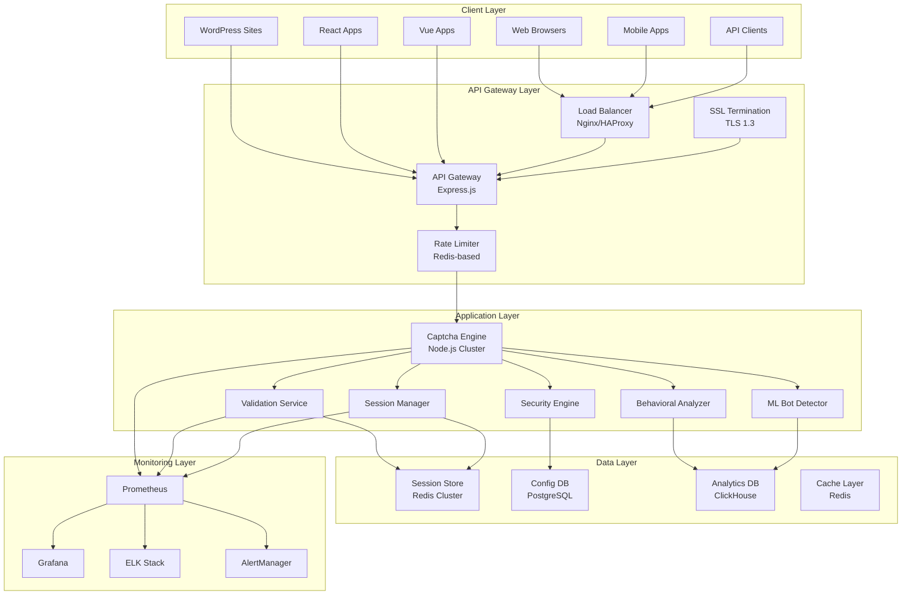
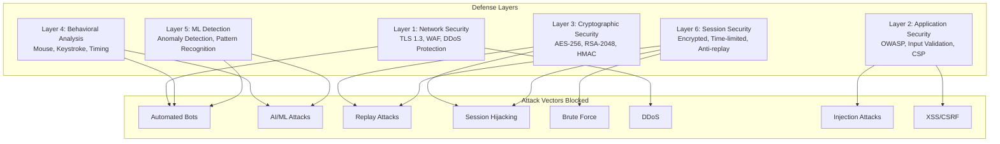

# Secure CAPTCHA Plugin - Functional Specification

## Document Information
- **Version**: 1.0.0
- **Date**: March 23, 2026
- **Status**: Draft
- **Classification**: Public

---

## 1. Executive Summary

### 1.1 Purpose
The Secure CAPTCHA Plugin is an enterprise-grade, open-source CAPTCHA solution designed to provide robust protection against automated bots while maintaining exceptional user experience. The plugin prioritizes **security as the prime factor** and aims to be **non-crackable** while delivering **lightning-fast performance**.

### 1.2 Scope
This document defines the functional requirements for building a complete CAPTCHA plugin from scratch that can be easily integrated into any application using any technology stack.

### 1.3 Key Objectives
1. **Non-Crackable Security**: Multi-layer defense against all known attack vectors
2. **Lightning Fast Performance**: < 100ms generation, < 50ms validation
3. **Universal Integration**: Support for 10+ frameworks and platforms
4. **Enterprise Ready**: SOC 2, GDPR compliant with comprehensive audit trails
5. **Open Source**: 10x cheaper than commercial solutions

---

## 2. System Overview

### 2.1 System Architecture



### 2.2 Security Architecture (Non-Crackable Design)



---

## 3. Functional Requirements

### 3.1 Captcha Types

#### 3.1.1 Text-Based Captcha
- **FR-1.1**: Generate cryptographically secure random text
- **FR-1.2**: Render text as image with security distortions
- **FR-1.3**: Apply noise patterns (lines, dots, warping)
- **FR-1.4**: Support configurable difficulty levels (easy, medium, hard)
- **FR-1.5**: Support configurable character sets (alphanumeric, numeric, alphabetic)
- **FR-1.6**: Support configurable length (4-8 characters)

#### 3.1.2 Mathematical Captcha
- **FR-2.1**: Generate arithmetic problems (addition, subtraction, multiplication, division)
- **FR-2.2**: Implement order of operations (PEMDAS)
- **FR-2.3**: Support fractions and decimals
- **FR-2.4**: Support configurable difficulty (1-5 complexity levels)
- **FR-2.5**: Render mathematical expressions as images

#### 3.1.3 Logic Puzzle Captcha
- **FR-3.1**: Generate pattern recognition puzzles
- **FR-3.2**: Generate sequence completion puzzles
- **FR-3.3**: Generate spatial reasoning puzzles
- **FR-3.4**: Support multiple puzzle types (visual, logical, mathematical)
- **FR-3.5**: Ensure puzzles are solvable by humans

#### 3.1.4 Image Recognition Captcha
- **FR-4.1**: Generate object identification challenges
- **FR-4.2**: Create SVG/Canvas images with security distortions
- **FR-4.3**: Support category-based selection (animals, vehicles, objects)
- **FR-4.4**: Implement visual complexity patterns
- **FR-4.5**: Support time-based validation

#### 3.1.5 Audio Captcha
- **FR-5.1**: Generate audio challenges with speech synthesis
- **FR-5.2**: Add background noise for security
- **FR-5.3**: Support multiple languages
- **FR-5.4**: Support configurable speech speed
- **FR-5.5**: Provide accessibility alternative

#### 3.1.6 Behavioral Captcha
- **FR-6.1**: Track mouse movement patterns
- **FR-6.2**: Track keystroke dynamics
- **FR-6.3**: Analyze interaction timing
- **FR-6.4**: Detect bot-like behavior patterns
- **FR-6.5**: Provide invisible verification option

#### 3.1.7 Invisible Captcha
- **FR-7.1**: Verify users without visible challenge
- **FR-7.2**: Use behavioral analysis for verification
- **FR-7.3**: Use device fingerprinting
- **FR-7.4**: Use IP reputation checking
- **FR-7.5**: Provide fallback to visible captcha

#### 3.1.8 Multi-Layer Captcha
- **FR-8.1**: Combine multiple captcha types
- **FR-8.2**: Support configurable layer combinations
- **FR-8.3**: Implement progressive difficulty
- **FR-8.4**: Support sequential validation
- **FR-8.5**: Provide single validation endpoint

### 3.2 Security Requirements

#### 3.2.1 Cryptographic Security
- **FR-9.1**: Implement AES-256-GCM encryption for all sensitive data
- **FR-9.2**: Implement RSA-2048 key pairs for secure communication
- **FR-9.3**: Implement HMAC-SHA256 for data integrity
- **FR-9.4**: Use cryptographically secure random number generation (CSPRNG)
- **FR-9.5**: Implement perfect forward secrecy (ECDH)
- **FR-9.6**: Implement automatic key rotation (every 24 hours)
- **FR-9.7**: Prepare for post-quantum cryptography
- **FR-9.8**: Implement secure key storage with hardware security module (HSM) support
- **FR-9.9**: Implement key derivation functions (PBKDF2, Argon2)
- **FR-9.10**: Implement digital signatures for data authenticity

#### 3.2.2 Anti-Automation
- **FR-10.1**: Generate unique challenges for each request
- **FR-10.2**: Implement time-based expiration (30-60 seconds)
- **FR-10.3**: Analyze behavioral patterns (mouse, keystroke, timing)
- **FR-10.4**: Implement device fingerprinting (browser, canvas, WebGL)
- **FR-10.5**: Check IP reputation against known bot databases
- **FR-10.6**: Implement progressive rate limiting
- **FR-10.7**: Implement CAPTCHA challenge escalation on suspicious activity
- **FR-10.8**: Implement geographic anomaly detection
- **FR-10.9**: Implement request pattern analysis
- **FR-10.10**: Implement automated tool detection (Selenium, Puppeteer, etc.)

#### 3.2.3 Anti-AI/ML
- **FR-11.1**: Generate adversarial examples to fool ML models
- **FR-11.2**: Apply random visual styles
- **FR-11.3**: Inject cryptographic noise in images
- **FR-11.4**: Randomize patterns unpredictably
- **FR-11.5**: Use human-only recognizable patterns
- **FR-11.6**: Implement style transfer for visual captchas
- **FR-11.7**: Implement dynamic difficulty adjustment based on threat level
- **FR-11.8**: Implement anti-OCR techniques for text captchas
- **FR-11.9**: Implement adversarial training for ML-resistant captchas
- **FR-11.10**: Implement continuous model updates to counter new AI techniques

#### 3.2.4 Session Security
- **FR-12.1**: Encrypt all session data at rest
- **FR-12.2**: Implement time-limited sessions (configurable TTL)
- **FR-12.3**: Prevent replay attacks
- **FR-12.4**: Detect session hijacking
- **FR-12.5**: Implement secure session invalidation
- **FR-12.6**: Implement session binding to IP and user agent
- **FR-12.7**: Implement concurrent session limiting
- **FR-12.8**: Implement session anomaly detection
- **FR-12.9**: Implement secure session token rotation
- **FR-12.10**: Implement session audit logging

#### 3.2.5 Input Validation
- **FR-13.1**: Prevent SQL injection attacks
- **FR-13.2**: Prevent XSS attacks
- **FR-13.3**: Prevent CSRF attacks
- **FR-13.4**: Prevent parameter pollution
- **FR-13.5**: Implement JSON schema validation
- **FR-13.6**: Implement whitelist-based input filtering
- **FR-13.7**: Implement content security policy (CSP) headers
- **FR-13.8**: Implement HTTP strict transport security (HSTS)
- **FR-13.9**: Implement X-Frame-Options header
- **FR-13.10**: Implement X-Content-Type-Options header
- **FR-13.11**: Implement X-XSS-Protection header
- **FR-13.12**: Implement Referrer-Policy header
- **FR-13.13**: Implement Permissions-Policy header

#### 3.2.6 Network Security
- **FR-14.1**: Implement TLS 1.3 for all communications
- **FR-14.2**: Implement perfect forward secrecy
- **FR-14.3**: Implement certificate pinning
- **FR-14.4**: Implement DDoS protection
- **FR-14.5**: Implement Web Application Firewall (WAF) rules
- **FR-14.6**: Implement IP whitelisting/blacklisting
- **FR-14.7**: Implement geographic blocking
- **FR-14.8**: Implement bot detection at network level
- **FR-14.9**: Implement traffic anomaly detection
- **FR-14.10**: Implement network segmentation

#### 3.2.7 Audit & Compliance
- **FR-15.1**: Implement comprehensive audit logging
- **FR-15.2**: Implement tamper-proof audit logs
- **FR-15.3**: Implement log retention policies
- **FR-15.4**: Implement real-time security monitoring
- **FR-15.5**: Implement security alerting system
- **FR-15.6**: Implement incident response automation
- **FR-15.7**: Implement compliance reporting (OWASP, SOC 2, GDPR)
- **FR-15.8**: Implement vulnerability scanning
- **FR-15.9**: Implement penetration testing integration
- **FR-15.10**: Implement security metrics dashboard

#### 3.2.8 Threat Intelligence
- **FR-16.1**: Implement IP reputation checking
- **FR-16.2**: Implement known bot signature detection
- **FR-16.3**: Implement attack pattern database
- **FR-16.4**: Implement real-time threat feed integration
- **FR-16.5**: Implement machine learning threat detection
- **FR-16.6**: Implement behavioral anomaly detection
- **FR-16.7**: Implement zero-day attack detection
- **FR-16.8**: Implement threat intelligence sharing
- **FR-16.9**: Implement automated threat response
- **FR-16.10**: Implement threat hunting capabilities

### 3.3 API Requirements

#### 3.3.1 RESTful API
- **FR-14.1**: POST /api/v1/captcha/generate - Generate captcha
- **FR-14.2**: POST /api/v1/captcha/validate - Validate response
- **FR-14.3**: GET /api/v1/captcha/types - List available types
- **FR-14.4**: POST /api/v1/session/create - Create session
- **FR-14.5**: DELETE /api/v1/session/:id - Invalidate session
- **FR-14.6**: GET /api/v1/health - Health check
- **FR-14.7**: GET /api/v1/metrics - Prometheus metrics

#### 3.3.2 GraphQL API
- **FR-15.1**: Query captcha types and configurations
- **FR-15.2**: Query session status
- **FR-15.3**: Mutation to generate captcha
- **FR-15.4**: Mutation to validate captcha
- **FR-15.5**: Subscription for security events

#### 3.3.3 API Security
- **FR-16.1**: JWT token authentication
- **FR-16.2**: API key authentication
- **FR-16.3**: Request signing validation
- **FR-16.4**: Rate limiting per API key
- **FR-16.5**: CORS configuration
- **FR-16.6**: Request/response logging

### 3.4 Integration Requirements

#### 3.4.1 Framework Plugins
- **FR-17.1**: Express.js middleware
- **FR-17.2**: Fastify plugin
- **FR-17.3**: Koa.js middleware
- **FR-17.4**: NestJS module

#### 3.4.2 Frontend Components
- **FR-18.1**: React component library
- **FR-18.2**: Vue.js plugin
- **FR-18.3**: Angular component
- **FR-18.4**: Svelte component
- **FR-18.5**: Vanilla JavaScript SDK

#### 3.4.3 CMS Plugins
- **FR-19.1**: WordPress plugin with form integrations
- **FR-19.2**: Drupal module
- **FR-19.3**: Shopify app

#### 3.4.4 Webhook Support
- **FR-20.1**: Event notifications (captcha_generated, captcha_validated, security_event)
- **FR-20.2**: Retry logic with exponential backoff
- **FR-20.3**: Payload signing for security
- **FR-20.4**: Delivery tracking and logging

### 3.5 Session Management

#### 3.5.1 Session Storage
- **FR-21.1**: Redis-based session storage
- **FR-21.2**: Session encryption at rest
- **FR-21.3**: Configurable session TTL
- **FR-21.4**: Automatic session cleanup
- **FR-21.5**: Session statistics tracking

#### 3.5.2 Caching
- **FR-22.1**: Multi-level caching (L1: Memory, L2: Redis)
- **FR-22.2**: Cache captcha configurations
- **FR-22.3**: Cache security policies
- **FR-22.4**: Cache invalidation strategies
- **FR-22.5**: Cache warming on startup

### 3.6 Monitoring & Observability

#### 3.6.1 Metrics
- **FR-23.1**: Request rate (requests/second)
- **FR-23.2**: Request latency (histogram)
- **FR-23.3**: Error rate (counter)
- **FR-23.4**: Captcha generation time
- **FR-23.5**: Captcha validation time
- **FR-23.6**: Active sessions (gauge)
- **FR-23.7**: Cache hit/miss ratio
- **FR-23.8**: Security events (counter)

#### 3.6.2 Logging
- **FR-24.1**: Structured logging with Winston
- **FR-24.2**: Request/response logging
- **FR-24.3**: Error logging
- **FR-24.4**: Security event logging
- **FR-24.5**: Performance logging
- **FR-24.6**: Audit logging

#### 3.6.3 Dashboards
- **FR-25.1**: Real-time performance dashboard
- **FR-25.2**: Security monitoring dashboard
- **FR-25.3**: Business metrics dashboard
- **FR-25.4**: Alerting rules

### 3.7 Compliance

#### 3.7.1 GDPR Compliance
- **FR-26.1**: Data minimization
- **FR-26.2**: Right to erasure
- **FR-26.3**: Data portability
- **FR-26.4**: Privacy by design
- **FR-26.5**: Consent management

#### 3.7.2 SOC 2 Compliance
- **FR-27.1**: Security controls
- **FR-27.2**: Availability monitoring
- **FR-27.3**: Processing integrity
- **FR-27.4**: Confidentiality
- **FR-27.5**: Privacy controls

#### 3.7.3 OWASP Compliance
- **FR-28.1**: OWASP Top 10 protection
- **FR-28.2**: Security headers (CSP, HSTS, X-Frame-Options)
- **FR-28.3**: Secure cookie configuration
- **FR-28.4**: CORS configuration

---

## 4. Non-Functional Requirements

### 4.1 Technology Stack for Easy Integration & High Throughput

#### 4.1.1 Core Technology Stack
- **Runtime**: Node.js 20+ with TypeScript 5+ (non-blocking I/O, high concurrency)
- **Framework**: Express.js 4.x with clustering (multi-core utilization)
- **Database**: PostgreSQL 15+ (ACID compliance, configuration storage)
- **Cache**: Redis 7+ (sub-millisecond latency, session management)
- **Queue**: Bull/BullMQ (async processing, job scheduling)
- **ML**: TensorFlow.js (real-time bot detection)

#### 4.1.2 Easy Integration Features
- **NFR-1.1**: RESTful API with OpenAPI 3.0 specification
- **NFR-1.2**: GraphQL API for flexible queries
- **NFR-1.3**: SDK support for 10+ frameworks (React, Vue, Angular, etc.)
- **NFR-1.4**: WordPress, Drupal, Shopify plugins
- **NFR-1.5**: Webhook support for event-driven architectures
- **NFR-1.6**: Docker containerization for any environment
- **NFR-1.7**: Kubernetes Helm charts for orchestration
- **NFR-1.8**: Environment-based configuration (12-factor app)
- **NFR-1.9**: Zero-dependency client-side SDK (< 50KB)
- **NFR-1.10**: 5-minute integration time for any framework

#### 4.1.3 High-Throughput Architecture
- **NFR-2.1**: Node.js event loop for non-blocking I/O
- **NFR-2.2**: Redis clustering for horizontal scaling
- **NFR-2.3**: Connection pooling (PostgreSQL: 100+ connections)
- **NFR-2.4**: Multi-level caching (L1: Memory, L2: Redis)
- **NFR-2.5**: Load balancing with Nginx/HAProxy
- **NFR-2.6**: Auto-scaling based on CPU/memory metrics
- **NFR-2.7**: Geographic distribution with CDN support
- **NFR-2.8**: Circuit breaker patterns for resilience
- **NFR-2.9**: Graceful degradation under high load
- **NFR-2.10**: Request queuing for burst traffic

### 4.2 Performance Requirements

#### 4.2.1 Response Time
- **NFR-3.1**: Captcha generation < 100ms (95th percentile)
- **NFR-3.2**: Captcha validation < 50ms (95th percentile)
- **NFR-3.3**: API response < 200ms (95th percentile)
- **NFR-3.4**: Page load impact < 500ms additional load time

#### 4.2.2 Throughput
- **NFR-4.1**: Support 100,000+ concurrent users
- **NFR-4.2**: Handle 10,000+ requests per second
- **NFR-4.3**: Generate 5,000+ captchas per second
- **NFR-4.4**: Validate 20,000+ captchas per second

#### 4.2.3 Scalability
- **NFR-5.1**: Horizontal scaling support
- **NFR-5.2**: Auto-scaling based on load
- **NFR-5.3**: Geographic distribution support
- **NFR-5.4**: CDN integration

### 4.2 Reliability Requirements

#### 4.2.1 Availability
- **NFR-4.1**: 99.99% uptime requirement
- **NFR-4.2**: Zero downtime deployments
- **NFR-4.3**: Graceful degradation under high load
- **NFR-4.4**: Circuit breaker patterns

#### 4.2.2 Error Handling
- **NFR-5.1**: Comprehensive error handling
- **NFR-5.2**: Error logging and monitoring
- **NFR-5.3**: User-friendly error messages
- **NFR-5.4**: Automatic error recovery

### 4.3 Security Requirements

#### 4.3.1 Data Protection
- **NFR-6.1**: Encryption at rest (AES-256)
- **NFR-6.2**: Encryption in transit (TLS 1.3)
- **NFR-6.3**: Secure key management
- **NFR-6.4**: Data retention policies

#### 4.3.2 Access Control
- **NFR-7.1**: Role-based access control (RBAC)
- **NFR-7.2**: API key management
- **NFR-7.3**: Audit logging
- **NFR-7.4**: Session management

### 4.4 Usability Requirements

#### 4.4.1 Developer Experience
- **NFR-8.1**: 5-minute integration time
- **NFR-8.2**: Comprehensive documentation
- **NFR-8.3**: Code examples for all frameworks
- **NFR-8.4**: TypeScript support

#### 4.4.2 User Experience
- **NFR-9.1**: Accessible (WCAG 2.1 AA compliant)
- **NFR-9.2**: Mobile responsive
- **NFR-9.3**: Multi-language support
- **NFR-9.4**: Customizable themes

### 4.5 Maintainability Requirements

#### 4.5.1 Code Quality
- **NFR-10.1**: 95%+ test coverage
- **NFR-10.2**: TypeScript for type safety
- **NFR-10.3**: ESLint with security rules
- **NFR-10.4**: Comprehensive documentation

#### 4.5.2 Deployment
- **NFR-10.5**: Docker containerization
- **NFR-10.6**: Kubernetes support
- **NFR-10.7**: CI/CD pipeline
- **NFR-10.8**: Blue-green deployments

---

## 5. Data Models

### 5.1 Captcha Session
```typescript
interface CaptchaSession {
  id: string;                    // UUID v4
  type: CaptchaType;             // text, math, logic, image, audio, behavioral, invisible, multi-layer
  difficulty: Difficulty;        // easy, medium, hard
  challenge: string;             // Encrypted challenge data
  answer: string;                // Encrypted answer
  createdAt: Date;
  expiresAt: Date;
  status: SessionStatus;         // active, validated, expired, failed
  metadata: SessionMetadata;
  securityScore: number;         // 0-100
  attempts: number;
  maxAttempts: number;
}

interface SessionMetadata {
  ip: string;
  userAgent: string;
  fingerprint: string;
  behavioralData: BehavioralData;
  deviceInfo: DeviceInfo;
}

interface BehavioralData {
  mouseMovements: MouseMovement[];
  keystrokeTimings: KeystrokeTiming[];
  interactionPatterns: InteractionPattern[];
}

interface DeviceInfo {
  browser: string;
  os: string;
  screenResolution: string;
  timezone: string;
  language: string;
}
```

### 5.2 Captcha Configuration
```typescript
interface CaptchaConfig {
  id: string;
  name: string;
  type: CaptchaType;
  difficulty: Difficulty;
  options: CaptchaOptions;
  security: SecurityConfig;
  createdAt: Date;
  updatedAt: Date;
}

interface CaptchaOptions {
  length?: number;               // For text captcha
  charset?: string;              // For text captcha
  operations?: string[];         // For math captcha
  puzzleTypes?: string[];        // For logic captcha
  categories?: string[];         // For image captcha
  language?: string;             // For audio captcha
  layers?: CaptchaType[];        // For multi-layer captcha
}

interface SecurityConfig {
  sessionTimeout: number;        // milliseconds
  maxAttempts: number;
  encryptionAlgorithm: string;
  keyRotationInterval: number;   // milliseconds
  enableBehavioralAnalysis: boolean;
  enableDeviceFingerprinting: boolean;
  enableIpReputation: boolean;
}
```

### 5.3 Security Event
```typescript
interface SecurityEvent {
  id: string;
  type: SecurityEventType;
  severity: 'low' | 'medium' | 'high' | 'critical';
  timestamp: Date;
  sessionId: string;
  ip: string;
  userAgent: string;
  details: SecurityEventDetails;
  resolved: boolean;
  resolvedAt?: Date;
  resolvedBy?: string;
}

type SecurityEventType = 
  | 'captcha_generated'
  | 'captcha_validated'
  | 'validation_failed'
  | 'session_expired'
  | 'rate_limit_exceeded'
  | 'bot_detected'
  | 'suspicious_activity'
  | 'authentication_failed'
  | 'authorization_failed'
  | 'injection_attempt'
  | 'xss_attempt'
  | 'csrf_attempt';

interface SecurityEventDetails {
  action: string;
  resource: string;
  reason: string;
  metadata: Record<string, any>;
}
```

### 5.4 API Key
```typescript
interface ApiKey {
  id: string;
  key: string;                   // Hashed
  name: string;
  userId: string;
  permissions: string[];
  rateLimit: RateLimit;
  createdAt: Date;
  expiresAt: Date;
  lastUsedAt?: Date;
  isActive: boolean;
}

interface RateLimit {
  requestsPerMinute: number;
  requestsPerHour: number;
  requestsPerDay: number;
  burstLimit: number;
}
```

---

## 6. API Specifications

### 6.1 RESTful API

#### 6.1.1 Generate Captcha
```http
POST /api/v1/captcha/generate
Authorization: Bearer <api_key>
Content-Type: application/json

{
  "type": "text",
  "difficulty": "medium",
  "options": {
    "length": 6,
    "charset": "alphanumeric"
  }
}
```

**Response:**
```json
{
  "success": true,
  "data": {
    "sessionId": "uuid-v4",
    "challenge": "encrypted-challenge-data",
    "type": "text",
    "difficulty": "medium",
    "expiresIn": 300000,
    "metadata": {
      "generatedAt": "2026-03-22T01:30:00Z",
      "securityScore": 95
    }
  }
}
```

#### 6.1.2 Validate Captcha
```http
POST /api/v1/captcha/validate
Authorization: Bearer <api_key>
Content-Type: application/json

{
  "sessionId": "uuid-v4",
  "response": "user-answer"
}
```

**Response:**
```json
{
  "success": true,
  "data": {
    "valid": true,
    "securityScore": 95,
    "message": "Captcha validated successfully"
  }
}
```

#### 6.1.3 List Captcha Types
```http
GET /api/v1/captcha/types
Authorization: Bearer <api_key>
```

**Response:**
```json
{
  "success": true,
  "data": {
    "types": [
      {
        "type": "text",
        "name": "Text Captcha",
        "description": "Text-based image captcha",
        "difficulties": ["easy", "medium", "hard"],
        "options": {
          "length": { "min": 4, "max": 8 },
          "charset": ["alphanumeric", "numeric", "alphabetic"]
        }
      }
    ]
  }
}
```

#### 6.1.4 Health Check
```http
GET /api/v1/health
```

**Response:**
```json
{
  "status": "healthy",
  "timestamp": "2026-03-22T01:30:00Z",
  "version": "1.0.0",
  "dependencies": {
    "redis": "connected",
    "postgres": "connected",
    "elasticsearch": "connected"
  },
  "metrics": {
    "uptime": 86400,
    "requestsPerSecond": 1500,
    "activeSessions": 5000
  }
}
```

#### 6.1.5 Metrics
```http
GET /api/v1/metrics
```

**Response:**
```
# HELP captcha_requests_total Total number of captcha requests
# TYPE captcha_requests_total counter
captcha_requests_total{method="POST",endpoint="/generate"} 15000

# HELP captcha_generation_duration_seconds Captcha generation duration
# TYPE captcha_generation_duration_seconds histogram
captcha_generation_duration_seconds_bucket{le="0.1"} 14500
captcha_generation_duration_seconds_bucket{le="0.5"} 15000

# HELP captcha_validation_duration_seconds Captcha validation duration
# TYPE captcha_validation_duration_seconds histogram
captcha_validation_duration_seconds_bucket{le="0.05"} 14800
captcha_validation_duration_seconds_bucket{le="0.1"} 15000
```

### 6.2 GraphQL API

#### 6.2.1 Schema
```graphql
type Query {
  captchaTypes: [CaptchaType!]!
  session(id: ID!): Session
  sessions(filter: SessionFilter): [Session!]!
  securityEvents(filter: SecurityEventFilter): [SecurityEvent!]!
}

type Mutation {
  generateCaptcha(input: GenerateCaptchaInput!): CaptchaResponse!
  validateCaptcha(input: ValidateCaptchaInput!): ValidationResponse!
  createSession(input: CreateSessionInput!): Session!
  invalidateSession(id: ID!): Boolean!
}

type Subscription {
  securityEvent: SecurityEvent!
  sessionStatusChanged(sessionId: ID!): Session!
}

input GenerateCaptchaInput {
  type: CaptchaType!
  difficulty: Difficulty!
  options: CaptchaOptionsInput
}

input ValidateCaptchaInput {
  sessionId: ID!
  response: String!
}

type CaptchaResponse {
  sessionId: ID!
  challenge: String!
  type: CaptchaType!
  difficulty: Difficulty!
  expiresIn: Int!
  metadata: SessionMetadata!
}

type ValidationResponse {
  valid: Boolean!
  securityScore: Int!
  message: String!
}

enum CaptchaType {
  TEXT
  MATH
  LOGIC
  IMAGE
  AUDIO
  BEHAVIORAL
  INVISIBLE
  MULTI_LAYER
}

enum Difficulty {
  EASY
  MEDIUM
  HARD
}
```

---

## 7. Error Handling

### 7.1 Error Codes
```typescript
enum ErrorCode {
  // Client Errors (4xx)
  INVALID_REQUEST = 'INVALID_REQUEST',
  INVALID_CAPTCHA_TYPE = 'INVALID_CAPTCHA_TYPE',
  INVALID_DIFFICULTY = 'INVALID_DIFFICULTY',
  INVALID_SESSION = 'INVALID_SESSION',
  SESSION_EXPIRED = 'SESSION_EXPIRED',
  VALIDATION_FAILED = 'VALIDATION_FAILED',
  RATE_LIMIT_EXCEEDED = 'RATE_LIMIT_EXCEEDED',
  AUTHENTICATION_REQUIRED = 'AUTHENTICATION_REQUIRED',
  AUTHORIZATION_FAILED = 'AUTHORIZATION_FAILED',
  
  // Server Errors (5xx)
  INTERNAL_ERROR = 'INTERNAL_ERROR',
  SERVICE_UNAVAILABLE = 'SERVICE_UNAVAILABLE',
  DATABASE_ERROR = 'DATABASE_ERROR',
  CACHE_ERROR = 'CACHE_ERROR',
  ENCRYPTION_ERROR = 'ENCRYPTION_ERROR',
  
  // Security Errors (6xx)
  BOT_DETECTED = 'BOT_DETECTED',
  SUSPICIOUS_ACTIVITY = 'SUSPICIOUS_ACTIVITY',
  INJECTION_ATTEMPT = 'INJECTION_ATTEMPT',
  XSS_ATTEMPT = 'XSS_ATTEMPT',
  CSRF_ATTEMPT = 'CSRF_ATTEMPT'
}
```

### 7.2 Error Response Format
```json
{
  "success": false,
  "error": {
    "code": "SESSION_EXPIRED",
    "message": "Captcha session has expired",
    "details": {
      "sessionId": "uuid-v4",
      "expiredAt": "2026-03-22T01:30:00Z"
    },
    "timestamp": "2026-03-22T01:35:00Z",
    "requestId": "req-uuid-v4"
  }
}
```

---

## 8. Testing Requirements

### 8.1 Unit Testing
- **TR-1.1**: 95%+ code coverage
- **TR-1.2**: 100% coverage for security-critical code
- **TR-1.3**: Test all edge cases
- **TR-1.4**: Test all error paths
- **TR-1.5**: Test all security scenarios

### 8.2 Integration Testing
- **TR-2.1**: Test all API endpoints
- **TR-2.2**: Test database integration
- **TR-2.3**: Test Redis integration
- **TR-2.4**: Test plugin integrations

### 8.3 Security Testing
- **TR-3.1**: OWASP ZAP automated scanning
- **TR-3.2**: Manual penetration testing
- **TR-3.3**: Dependency vulnerability scanning
- **TR-3.4**: Container security scanning

### 8.4 Performance Testing
- **TR-4.1**: Load testing with k6 (10,000+ concurrent users)
- **TR-4.2**: Stress testing
- **TR-4.3**: Endurance testing
- **TR-4.4**: Spike testing

### 8.5 End-to-End Testing
- **TR-5.1**: Test complete captcha flow
- **TR-5.2**: Cross-browser testing
- **TR-5.3**: Mobile responsiveness testing
- **TR-5.4**: Accessibility testing

---

## 9. Deployment Requirements

### 9.1 Containerization
- **DR-1.1**: Multi-stage Dockerfile
- **DR-1.2**: Docker Compose for local development
- **DR-1.3**: Production Docker images
- **DR-1.4**: Security scanning with Trivy

### 9.2 Orchestration
- **DR-2.1**: Kubernetes manifests
- **DR-2.2**: Helm charts
- **DR-2.3**: Horizontal Pod Autoscaler
- **DR-2.4**: Pod Security Policies

### 9.3 CI/CD
- **DR-3.1**: GitHub Actions workflows
- **DR-3.2**: Automated testing
- **DR-3.3**: Security scanning
- **DR-3.4**: Deployment automation

---

## 10. Documentation Requirements

### 10.1 API Documentation
- **DocR-1.1**: OpenAPI 3.0 specification
- **DocR-1.2**: Swagger UI
- **DocR-1.3**: Postman collection
- **DocR-1.4**: API versioning documentation

### 10.2 Developer Documentation
- **DocR-2.1**: Getting started guide
- **DocR-2.2**: Integration guides for each framework
- **DocR-2.3**: Configuration documentation
- **DocR-2.4**: Troubleshooting guide

### 10.3 Operations Documentation
- **DocR-3.1**: Deployment guide
- **DocR-3.2**: Operations runbook
- **DocR-3.3**: Monitoring guide
- **DocR-3.4**: Incident response procedures

---

## 11. Success Criteria

### 11.1 Security Success Criteria
- **SC-1.1**: Zero security breaches
- **SC-1.2**: 99.9% bot detection accuracy
- **SC-1.3**: 0.01% false positive rate
- **SC-1.4**: 100% OWASP compliance

### 11.2 Performance Success Criteria
- **SC-2.1**: < 100ms captcha generation
- **SC-2.2**: < 50ms captcha validation
- **SC-2.3**: 10,000+ RPS throughput
- **SC-2.4**: 99.99% uptime

### 11.3 Usability Success Criteria
- **SC-3.1**: < 5 minutes integration time
- **SC-3.2**: Support for 10+ frameworks
- **SC-3.3**: Comprehensive documentation
- **SC-3.4**: Active community support

---

## 12. Glossary

- **CAPTCHA**: Completely Automated Public Turing test to tell Computers and Humans Apart
- **CSPRNG**: Cryptographically Secure Pseudo-Random Number Generator
- **ECDH**: Elliptic Curve Diffie-Hellman key exchange
- **HMAC**: Hash-based Message Authentication Code
- **JWT**: JSON Web Token
- **OWASP**: Open Web Application Security Project
- **RBAC**: Role-Based Access Control
- **SOC 2**: Service Organization Control 2
- **TLS**: Transport Layer Security
- **WAF**: Web Application Firewall

---

## Document Control

**Version History**:
- v1.0.0 (2026-03-22): Initial functional specification

**Review Schedule**:
- Weekly reviews during development
- Major review before each phase
- Post-implementation validation

**Approval Requirements**:
- Security team approval for security requirements
- Development team approval for technical specifications
- Product owner approval for functional requirements