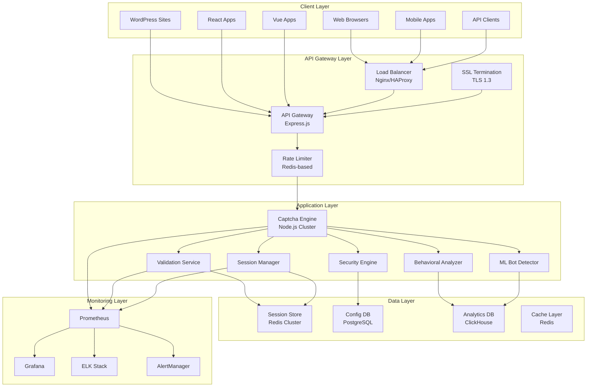
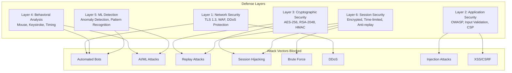

# Secure CAPTCHA Plugin

> **Enterprise-grade, non-crackable CAPTCHA solution with lightning-fast performance**

[](https://opensource.org/licenses/MIT)
[](https://www.typescriptlang.org/)
[](https://nodejs.org/)
[](#security)

## 🎯 Overview

The Secure CAPTCHA Plugin is an **enterprise-grade, open-source CAPTCHA solution** designed to provide robust protection against automated bots while maintaining exceptional user experience. Built from scratch with **security as the prime factor**, this plugin aims to be **non-crackable** while delivering **lightning-fast performance**.

### Key Objectives

1. **Non-Crackable Security**: Multi-layer defense against all known attack vectors
2. **Lightning Fast Performance**: < 100ms generation, < 50ms validation
3. **Universal Integration**: Support for 10+ frameworks and platforms
4. **Enterprise Ready**: SOC 2, GDPR compliant with comprehensive audit trails
5. **Open Source**: 10x cheaper than commercial solutions

---

## 🏗️ Architecture

### System Architecture



### Security Architecture (Non-Crackable Design)



---

## 🛡️ Security Features

### 6-Layer Defense System

| Layer | Security Feature | Protection Against |
|-------|------------------|-------------------|
| **Layer 1** | Network Security | DDoS, WAF, TLS 1.3 |
| **Layer 2** | Application Security | OWASP Top 10, Input Validation, CSP |
| **Layer 3** | Cryptographic Security | AES-256, RSA-2048, HMAC-SHA256 |
| **Layer 4** | Behavioral Analysis | Mouse, Keystroke, Timing Patterns |
| **Layer 5** | ML Detection | Anomaly Detection, Pattern Recognition |
| **Layer 6** | Session Security | Encrypted, Time-limited, Anti-replay |

### Anti-Automation Techniques

- **Dynamic Challenge Generation**: Each captcha is unique
- **Time-based Expiration**: Challenges expire in 30-60 seconds
- **Behavioral Analysis**: Mouse movement, keystroke patterns
- **Device Fingerprinting**: Comprehensive browser, canvas, WebGL, audio, font, hardware, and network fingerprinting with anomaly detection and risk scoring
- **IP Reputation**: Known bot IP blocking
- **Rate Limiting**: Progressive delays for suspicious activity

### Anti-AI/ML Techniques

- **Adversarial Examples**: Captchas designed to fool ML models
- **Style Transfer**: Random visual styles
- **Noise Injection**: Cryptographic noise in images
- **Pattern Randomization**: Unpredictable patterns
- **Human-Only Patterns**: Patterns only humans can recognize

### Threat Intelligence

- **IP Reputation Checking**: Real-time IP reputation scoring against threat indicators
- **Bot Signature Detection**: Pre-configured signatures for known bots (Googlebot, Bingbot, Headless Chrome, Selenium, Puppeteer, PhantomJS, etc.)
- **Attack Pattern Database**: Detection of SQL injection, XSS, path traversal, command injection, and brute force patterns
- **Threat Feeds**: Support for multiple threat feed sources with configurable update intervals
- **Comprehensive Threat Analysis**: Combined analysis of IP, user agent, and input with risk scoring and actionable recommendations

#### Threat Intelligence Usage

```typescript
import { ThreatIntelligence } from 'secure-captcha-plugin';

// Initialize threat intelligence
const threatIntel = new ThreatIntelligence({
  enableIPReputation: true,
  enableBotSignatures: true,
  enableAttackPatterns: true,
  enableThreatFeeds: true,
  confidenceThreshold: 0.7
}, securityLogger);

// Check IP reputation
const ipReputation = await threatIntel.checkIPReputation('192.168.1.1');
if (ipReputation && ipReputation.reputation < 50) {
  console.log(`Suspicious IP detected: ${ipReputation.threatLevel}`);
}

// Check user agent against bot signatures
const botSignatures = threatIntel.checkBotSignatures(
  'Mozilla/5.0 (compatible; Googlebot/2.1)'
);
if (botSignatures.length > 0) {
  console.log(`Bot detected: ${botSignatures[0].name}`);
}

// Check input for attack patterns
const attackPatterns = threatIntel.checkAttackPatterns(
  "1 UNION SELECT * FROM users"
);
if (attackPatterns.length > 0) {
  console.log(`Attack detected: ${attackPatterns[0].name}`);
}

// Comprehensive threat check
const threatResult = await threatIntel.checkThreat({
  ip: '192.168.1.1',
  userAgent: 'Mozilla/5.0',
  input: 'user-input-data'
});

if (threatResult.isThreat) {
  console.log(`Threat level: ${threatResult.threatLevel}`);
  console.log(`Recommendations: ${threatResult.recommendations}`);
}

// Add custom threat indicator
threatIntel.addThreatIndicator({
  type: 'ip',
  value: '10.0.0.1',
  category: 'bot',
  threatLevel: 'high',
  confidence: 0.9,
  source: 'internal',
  description: 'Known malicious IP',
  tags: ['malicious', 'bot'],
  metadata: {}
});

// Add custom bot signature
threatIntel.addBotSignature({
  name: 'Custom Bot',
  pattern: /custombot/i,
  patternType: 'regex',
  category: 'bot',
  threatLevel: 'medium',
  description: 'Custom bot detection',
  confidence: 0.8,
  source: 'internal',
  isActive: true
});

// Get threat intelligence statistics
const stats = threatIntel.getStats();
console.log(`Total indicators: ${stats.totalIndicators}`);
console.log(`Bot signatures: ${stats.botSignatures}`);
console.log(`Attack patterns: ${stats.attackPatterns}`);
```

#### Threat Intelligence Configuration

```typescript
const threatIntelConfig = {
  // IP Reputation
  enableIPReputation: true,
  ipReputationCacheTTL: 3600, // seconds
  ipReputationSources: ['internal', 'abuseipdb', 'virustotal'],
  
  // Bot Signatures
  enableBotSignatures: true,
  botSignatureCacheTTL: 1800, // seconds
  
  // Attack Patterns
  enableAttackPatterns: true,
  attackPatternCacheTTL: 1800, // seconds
  
  // Threat Feeds
  enableThreatFeeds: true,
  threatFeedUpdateInterval: 60, // minutes
  maxIndicatorsPerFeed: 10000,
  
  // General
  enableRealTimeUpdates: true,
  enableLogging: true,
  confidenceThreshold: 0.7, // 0-1
  maxCacheSize: 100000
};
```

#### Pre-configured Bot Signatures

The Threat Intelligence module includes pre-configured signatures for common bots and automation tools:

| Bot/Tool | Category | Threat Level | Description |
|----------|----------|--------------|-------------|
| Googlebot | bot | low | Google search crawler |
| Bingbot | bot | low | Bing search crawler |
| Scrapy | scanner | medium | Web scraping framework |
| Python Requests | scanner | medium | Python HTTP library |
| curl | scanner | low | Command line HTTP client |
| wget | scanner | low | Download utility |
| Headless Chrome | bot | high | Headless browser automation |
| PhantomJS | bot | high | Headless browser |
| Selenium | bot | high | WebDriver automation |
| Puppeteer | bot | high | Headless browser automation |

#### Pre-configured Attack Patterns

| Attack Type | Severity | CWE | CVSS | Description |
|-------------|----------|-----|------|-------------|
| SQL Injection - UNION | critical | CWE-89 | 9.8 | UNION-based SQL injection |
| SQL Injection - OR/AND | critical | CWE-89 | 9.8 | Boolean-based SQL injection |
| SQL Injection - Comment | high | CWE-89 | 8.6 | Comment-based SQL injection |
| XSS - Script Tag | high | CWE-79 | 7.5 | Script tag injection |
| XSS - Event Handlers | high | CWE-79 | 7.5 | Event handler injection |
| Path Traversal | high | CWE-22 | 7.5 | Directory traversal attacks |
| Command Injection | critical | CWE-78 | 9.8 | OS command injection |
| Brute Force | high | CWE-307 | 7.5 | Multiple failed logins |

---

## 🚀 Technology Stack

### Core Technology Stack

| Component | Technology | Version | Purpose |
|-----------|------------|---------|---------|
| **Runtime** | Node.js | 20+ | Non-blocking I/O, high concurrency |
| **Language** | TypeScript | 5.0+ | Type safety, better DX |
| **Framework** | Express.js | 4.x | RESTful API with clustering |
| **Database** | PostgreSQL | 15+ | ACID compliance, config storage |
| **Cache** | Redis | 7+ | Sub-millisecond latency, sessions |
| **Queue** | Bull/BullMQ | Latest | Async processing, job scheduling |
| **ML** | TensorFlow.js | Latest | Real-time bot detection |

### Frontend & Integration

| Component | Technology | Purpose |
|-----------|------------|---------|
| **React** | 18+ | Component library |
| **Vue.js** | 3+ | Composition API plugin |
| **Angular** | 16+ | Standalone components |
| **Svelte** | 4+ | Runes-based components |
| **Vanilla JS** | ES2020+ | Zero-dependency SDK |

### Infrastructure

| Component | Technology | Purpose |
|-----------|------------|---------|
| **Containerization** | Docker | Multi-stage builds |
| **Orchestration** | Kubernetes | Helm charts, auto-scaling |
| **Monitoring** | Prometheus + Grafana | Metrics and dashboards |
| **Logging** | ELK Stack | Centralized logging |
| **CI/CD** | GitHub Actions | Automated testing & deployment |

---

## 🔧 Design Patterns

### 1. Factory Pattern
```typescript
// CaptchaGeneratorFactory for creating different captcha types
class CaptchaGeneratorFactory {
  static getGenerator(type: CaptchaType): CaptchaGenerator {
    switch (type) {
      case 'text': return new TextCaptchaGenerator();
      case 'math': return new MathCaptchaGenerator();
      case 'logic': return new LogicCaptchaGenerator();
      case 'image': return new ImageCaptchaGenerator();
      // ... more types
    }
  }
}
```

### 2. Strategy Pattern
```typescript
// Different validation strategies for different captcha types
interface ValidationStrategy {
  validate(session: CaptchaSession, response: string): ValidationResult;
}

class TextValidationStrategy implements ValidationStrategy { /* ... */ }
class MathValidationStrategy implements ValidationStrategy { /* ... */ }
class BehavioralValidationStrategy implements ValidationStrategy { /* ... */ }
```

### 3. Observer Pattern
```typescript
// Security event system for monitoring and alerting
class SecurityEventEmitter {
  subscribe(event: SecurityEventType, handler: EventHandler): void;
  emit(event: SecurityEvent): void;
}
```

### 4. Decorator Pattern
```typescript
// Middleware for adding security features to routes
function captchaMiddleware(options: CaptchaOptions) {
  return (req, res, next) => {
    // Add rate limiting
    // Add behavioral analysis
    // Add device fingerprinting
    next();
  };
}
```

### 5. Singleton Pattern
```typescript
// Single instance of CryptoService for key management
class CryptoService {
  private static instance: CryptoService;
  
  static getInstance(): CryptoService {
    if (!CryptoService.instance) {
      CryptoService.instance = new CryptoService();
    }
    return CryptoService.instance;
  }
}
```

### 6. Circuit Breaker Pattern
```typescript
// Resilience pattern for external service calls
class CircuitBreaker {
  private state: 'closed' | 'open' | 'half-open' = 'closed';
  private failureCount = 0;
  
  async call<T>(fn: () => Promise<T>): Promise<T> {
    if (this.state === 'open') {
      throw new Error('Circuit breaker is open');
    }
    // ... implementation
  }
}
```

---

## 🔐 Algorithms

### Cryptographic Algorithms

| Algorithm | Purpose | Key Size | Notes |
|-----------|---------|----------|-------|
| **AES-256-GCM** | Data encryption | 256-bit | Authenticated encryption |
| **RSA-2048** | Key exchange | 2048-bit | Asymmetric encryption |
| **HMAC-SHA256** | Data integrity | 256-bit | Message authentication |
| **ECDH** | Perfect forward secrecy | 256-bit | Key agreement protocol |
| **PBKDF2** | Key derivation | 256-bit | Password-based key derivation |
| **Argon2** | Password hashing | 256-bit | Memory-hard function |

### Machine Learning Algorithms

| Algorithm | Purpose | Implementation |
|-----------|---------|----------------|
| **Random Forest** | Bot detection | TensorFlow.js |
| **Neural Network** | Behavioral analysis | TensorFlow.js |
| **Anomaly Detection** | Pattern recognition | Statistical methods |
| **Clustering** | User segmentation | K-means algorithm |

### Behavioral Analysis Algorithms

| Algorithm | Purpose | Metrics |
|-----------|---------|---------|
| **Mouse Movement Analysis** | Human vs bot detection | Speed, acceleration, patterns |
| **Keystroke Dynamics** | Typing pattern analysis | Timing, pressure, rhythm |
| **Timing Analysis** | Interaction patterns | Response time, consistency |
| **Device Fingerprinting** | Unique device identification | Browser, canvas, WebGL, audio, fonts, hardware, network, anomaly detection, risk scoring |

---

## 📊 Performance

### Response Time Targets

| Operation | Target | Percentile |
|-----------|--------|------------|
| Captcha Generation | < 100ms | 95th |
| Captcha Validation | < 50ms | 95th |
| API Response | < 200ms | 95th |
| Page Load Impact | < 500ms | Additional load time |

### Throughput Targets

| Metric | Target |
|--------|--------|
| Concurrent Users | 100,000+ |
| Requests per Second | 10,000+ |
| Captcha Generation | 5,000+ per second |
| Validation | 20,000+ per second |

### Scalability Features

- **Horizontal Scaling**: Redis clustering, load balancing
- **Auto-scaling**: Based on CPU/memory metrics
- **Geographic Distribution**: CDN support, multi-region
- **Connection Pooling**: PostgreSQL: 100+ connections
- **Multi-level Caching**: L1: Memory, L2: Redis

---

## 🔌 Integration

### Framework Support

| Framework | Plugin Type | Integration Time |
|-----------|-------------|------------------|
| **Express.js** | Middleware | < 5 minutes |
| **Fastify** | Plugin | < 5 minutes |
| **Koa.js** | Middleware | < 5 minutes |
| **NestJS** | Module | < 5 minutes |
| **React** | Component Library | < 5 minutes |
| **Vue.js** | Plugin | < 5 minutes |
| **Angular** | Component | < 5 minutes |
| **Svelte** | Component | < 5 minutes |
| **WordPress** | Plugin | < 5 minutes |
| **Drupal** | Module | < 5 minutes |

### API Support

| API Type | Protocol | Documentation |
|----------|----------|---------------|
| **RESTful** | HTTP/HTTPS | OpenAPI 3.0 |
| **GraphQL** | HTTP/HTTPS | Schema-first |
| **WebSocket** | WS/WSS | Real-time events |
| **Webhooks** | HTTP/HTTPS | Event-driven |

### Quick Integration Examples

#### Express.js
```typescript
import { captchaMiddleware } from 'secure-captcha-plugin';

app.use('/api/protected', captchaMiddleware({
  type: 'multi-layer',
  difficulty: 'hard',
  sessionTimeout: 300000
}));
```

#### React
```tsx
import { CaptchaWidget } from 'secure-captcha-plugin/react';

<CaptchaWidget
  type="multi-layer"
  difficulty="hard"
  onVerify={(token) => handleVerify(token)}
  theme="dark"
/>
```

#### WordPress
```php
// Add to any form
<?php echo captcha_get_html(); ?>
```

---

## 🔐 Cryptographic Service

The CryptoService provides enterprise-grade cryptographic operations for securing CAPTCHA sessions and sensitive data.

### CryptoService Usage

```typescript
import { CryptoService } from 'secure-captcha-plugin';

// Initialize the crypto service
const cryptoService = new CryptoService({
  encryption: {
    algorithm: 'aes-256-gcm',
    keySize: 256,
    ivLength: 16,
    tagLength: 16
  },
  hashing: {
    algorithm: 'sha256',
    saltLength: 32
  },
  signing: {
    algorithm: 'rsa',
    keySize: 2048
  }
});

// Encrypt sensitive data
const encrypted = await cryptoService.encrypt('sensitive-data', 'encryption-key');
console.log(encrypted.encryptedData);
console.log(encrypted.iv);
console.log(encrypted.authTag);

// Decrypt data
const decrypted = await cryptoService.decrypt(
  encrypted.encryptedData,
  'encryption-key',
  encrypted.iv,
  encrypted.authTag
);

// Generate HMAC signature
const signature = await cryptoService.generateHMAC('data-to-sign', 'secret-key');
console.log(signature.hash);

// Verify HMAC signature
const isValid = await cryptoService.verifyHMAC(
  'data-to-sign',
  signature.hash,
  'secret-key'
);

// Generate RSA key pair
const keyPair = await cryptoService.generateKeyPair();
console.log(keyPair.publicKey);
console.log(keyPair.privateKey);

// Generate secure random token
const token = await cryptoService.generateSecureToken(32);
console.log(token);

// Generate session token with UUID v4
const sessionToken = await cryptoService.generateSessionToken();
console.log(sessionToken.sessionId);

// Get cryptographic statistics
const stats = cryptoService.getStats();
console.log(`Total operations: ${stats.totalOperations}`);
console.log(`Success rate: ${stats.successfulOperations / stats.totalOperations * 100}%`);
```

### CryptoService Configuration

```typescript
const cryptoConfig = {
  encryption: {
    algorithm: 'aes-256-gcm',
    keySize: 256,
    ivLength: 16,
    tagLength: 16
  },
  hashing: {
    algorithm: 'sha256',
    saltLength: 32
  },
  signing: {
    algorithm: 'rsa',
    keySize: 2048
  },
  random: {
    algorithm: 'crypto',
    minEntropy: 256
  }
};
```

---

## 🎯 CAPTCHA Generators

The plugin provides multiple CAPTCHA generator types, each designed for different use cases and security levels.

### Text CAPTCHA

```typescript
import { TextCaptchaGenerator } from 'secure-captcha-plugin';

const textGenerator = new TextCaptchaGenerator({
  minLength: 4,
  maxLength: 8,
  characterSet: 'alphanumeric',
  caseSensitive: false,
  distortionLevel: 'medium',
  noiseLevel: 'medium'
});

// Generate text CAPTCHA
const captcha = await textGenerator.generate({
  difficulty: 'medium',
  sessionId: 'session-123'
});

console.log(captcha.image); // Base64 encoded image
console.log(captcha.sessionId);
console.log(captcha.expiresAt);

// Validate response
const isValid = await textGenerator.validate(
  captcha.sessionId,
  userResponse
);
```

### Math CAPTCHA

```typescript
import { MathCaptchaGenerator } from 'secure-captcha-plugin';

const mathGenerator = new MathCaptchaGenerator({
  operations: ['+', '-', '*'],
  minNumber: 1,
  maxNumber: 20,
  includeFractions: false,
  includeDecimals: false,
  complexityLevel: 'medium'
});

// Generate math CAPTCHA
const captcha = await mathGenerator.generate({
  difficulty: 'hard',
  sessionId: 'session-456'
});

console.log(captcha.problem); // e.g., "12 + 8 * 3"
console.log(captcha.image);

// Validate response (follows PEMDAS order)
const isValid = await mathGenerator.validate(
  captcha.sessionId,
  userResponse
);
```

### Logic CAPTCHA

```typescript
import { LogicCaptchaGenerator } from 'secure-captcha-plugin';

const logicGenerator = new LogicCaptchaGenerator({
  puzzleTypes: ['pattern', 'sequence', 'spatial'],
  minComplexity: 3,
  maxComplexity: 7,
  timeLimit: 60000
});

// Generate logic CAPTCHA
const captcha = await logicGenerator.generate({
  difficulty: 'hard',
  sessionId: 'session-789'
});

console.log(captcha.puzzleType); // e.g., 'pattern'
console.log(captcha.instructions);
console.log(captcha.image);

// Validate response
const isValid = await logicGenerator.validate(
  captcha.sessionId,
  userResponse
);
```

### Image CAPTCHA

```typescript
import { ImageCaptchaGenerator } from 'secure-captcha-plugin';

const imageGenerator = new ImageCaptchaGenerator({
  objectCount: 3,
  objectTypes: ['car', 'bus', 'traffic_light', 'crosswalk'],
  gridSize: 3,
  includeLabels: true,
  timeLimit: 45000
});

// Generate image CAPTCHA
const captcha = await imageGenerator.generate({
  difficulty: 'medium',
  sessionId: 'session-101'
});

console.log(captcha.challenge); // e.g., "Select all images with cars"
console.log(captcha.images); // Array of image URLs
console.log(captcha.gridSize);

// Validate response
const isValid = await imageGenerator.validate(
  captcha.sessionId,
  selectedImages
);
```

### Multi-Layer CAPTCHA

```typescript
import { CaptchaService } from 'secure-captcha-plugin';

const captchaService = new CaptchaService({
  layers: ['text', 'math', 'behavioral'],
  difficulty: 'hard',
  sessionTimeout: 300000,
  maxAttempts: 3
});

// Generate multi-layer CAPTCHA
const captcha = await captchaService.generateMultiLayer({
  sessionId: 'session-multi',
  layers: ['text', 'behavioral'],
  difficulty: 'hard'
});

console.log(captcha.layers); // Array of CAPTCHA layers
console.log(captcha.currentLayer);
console.log(captcha.totalLayers);

// Validate each layer
for (const layer of captcha.layers) {
  const isValid = await captchaService.validateLayer(
    captcha.sessionId,
    layer.id,
    userResponses[layer.id]
  );
}
```

---

## 🖱️ Behavioral Analysis

The behavioral analysis system tracks user interactions to distinguish between humans and bots.

### Mouse Movement Tracking

```typescript
import { MouseMovementAnalyzer } from 'secure-captcha-plugin';

const mouseAnalyzer = new MouseMovementAnalyzer({
  samplingRate: 50, // ms
  minDataPoints: 10,
  anomalyThreshold: 0.7
});

// Analyze mouse movement session
const analysis = await mouseAnalyzer.analyze(sessionData);

console.log(analysis.movementNaturalness); // 0-1 score
console.log(analysis.velocityConsistency);
console.log(analysis.accelerationPattern);
console.log(analysis.pathEfficiency);
console.log(analysis.microMovementPresence);

// Detect anomalies
if (analysis.anomalies.length > 0) {
  console.log('Detected anomalies:');
  analysis.anomalies.forEach(anomaly => {
    console.log(`- ${anomaly.type}: ${anomaly.description}`);
  });
}

// Get bot detection result
const botDetection = await mouseAnalyzer.performBotDetection(sessionData);
console.log(`Verdict: ${botDetection.verdict}`); // 'human', 'bot', 'suspicious'
console.log(`Confidence: ${botDetection.confidence}`);
console.log(`Bot score: ${botDetection.botScore}`);
```

### Keystroke Dynamics

```typescript
import { KeystrokeDynamicsAnalyzer } from 'secure-captcha-plugin';

const keystrokeAnalyzer = new KeystrokeDynamicsAnalyzer({
  minEvents: 5,
  anomalyThreshold: 0.6
});

// Analyze keystroke patterns
const analysis = await keystrokeAnalyzer.analyze(keystrokeEvents);

console.log(analysis.typingSpeed); // Characters per minute
console.log(analysis.rhythmConsistency);
console.log(analysis.holdTimeVariance);
console.log(analysis.flightTimeVariance);
console.log(analysis.errorRate);

// Detect bot-like typing patterns
const botDetection = await keystrokeAnalyzer.performBotDetection(keystrokeEvents);
console.log(`Verdict: ${botDetection.verdict}`);
console.log(`Risk factors: ${botDetection.riskFactors}`);
```

### Device Fingerprinting

```typescript
import { DeviceFingerprintAnalyzer } from 'secure-captcha-plugin';

const fingerprintAnalyzer = new DeviceFingerprintAnalyzer({
  includeCanvas: true,
  includeWebGL: true,
  includeAudio: true,
  includeFonts: true,
  anomalyThreshold: 0.5
});

// Generate device fingerprint
const fingerprint = await fingerprintAnalyzer.generate(request);

console.log(fingerprint.browser); // Browser fingerprint
console.log(fingerprint.canvas); // Canvas fingerprint
console.log(fingerprint.webgl); // WebGL fingerprint
console.log(fingerprint.audio); // Audio fingerprint
console.log(fingerprint.fonts); // Font fingerprint
console.log(fingerprint.hardware); // Hardware fingerprint
console.log(fingerprint.network); // Network fingerprint

// Check for anomalies
const anomalies = await fingerprintAnalyzer.detectAnomalies(fingerprint);
if (anomalies.length > 0) {
  console.log('Fingerprint anomalies detected:');
  anomalies.forEach(anomaly => {
    console.log(`- ${anomaly.type}: ${anomaly.description}`);
  });
}

// Calculate risk score
const riskScore = await fingerprintAnalyzer.calculateRiskScore(fingerprint);
console.log(`Risk score: ${riskScore.score}`); // 0-100
console.log(`Risk level: ${riskScore.level}`); // 'low', 'medium', 'high'
```

---

## 🤖 Machine Learning Bot Detection

The ML-based bot detection system uses TensorFlow.js to analyze behavioral patterns and detect automated traffic.

### Bot Detection ML Usage

```typescript
import { BotDetectionML } from 'secure-captcha-plugin';

const botDetector = new BotDetectionML({
  modelPath: './models/bot-detection',
  featureDimensions: 50,
  confidenceThreshold: 0.7,
  usePretrainedModel: true
});

// Initialize the ML model
await botDetector.initialize();

// Extract features from behavioral session
const features = botDetector.extractFeatures(sessionData);
console.log(`Extracted ${features.length} features`);

// Make prediction
const prediction = await botDetector.predict(sessionData);
console.log(`Bot probability: ${prediction.botProbability}`);
console.log(`Human probability: ${prediction.humanProbability}`);
console.log(`Confidence: ${prediction.confidence}`);

// Comprehensive bot detection (ML + rule-based)
const detection = await botDetector.detectBot(sessionData);
console.log(`Verdict: ${detection.verdict}`);
console.log(`Bot score: ${detection.botScore}`);
console.log(`Anomalies: ${detection.anomalies.length}`);
console.log(`Risk factors: ${detection.riskFactors}`);

// Train model with new data
const trainingData = {
  features: [/* feature arrays */],
  labels: [0, 1, 0, 1, ...], // 0 = human, 1 = bot
  metadata: [/* session metadata */]
};

const metrics = await botDetector.train(trainingData);
console.log(`Accuracy: ${metrics.accuracy}`);
console.log(`Precision: ${metrics.precision}`);
console.log(`Recall: ${metrics.recall}`);
console.log(`F1 Score: ${metrics.f1Score}`);

// Save trained model
await botDetector.saveModel('./models/custom-model');

// Get model statistics
const stats = botDetector.getStats();
console.log(`Model loaded: ${stats.modelLoaded}`);
console.log(`Feature cache size: ${stats.featureCacheSize}`);
```

### Feature Engineering

The ML model extracts 50 features from behavioral sessions:

| Category | Features | Count |
|----------|----------|-------|
| **Movement** | Velocity, acceleration, path efficiency, angles, jerk | 20 |
| **Keystroke** | Hold time, flight time, typing speed, rhythm | 15 |
| **Click** | Duration, variance, accuracy, interval | 8 |
| **Scroll** | Speed, direction consistency, smoothness | 5 |
| **Timing** | Session duration, response time | 2 |

---

## 📊 Anomaly Detection

The anomaly detection system uses statistical analysis, time series analysis, and pattern deviation detection to identify suspicious behavior.

### Anomaly Detection Usage

```typescript
import { AnomalyDetector } from 'secure-captcha-plugin';

const anomalyDetector = new AnomalyDetector({
  statisticalThreshold: 2.0,
  timeSeriesWindowSize: 100,
  patternDeviationThreshold: 0.3,
  adaptiveThresholdLearningRate: 0.1
});

// Detect anomalies in behavioral session
const result = await anomalyDetector.detectAnomalies(sessionData);

console.log(`Anomaly score: ${result.anomalyScore}`); // 0-1
console.log(`Anomalies detected: ${result.anomalies.length}`);

// Review detected anomalies
result.anomalies.forEach(anomaly => {
  console.log(`Type: ${anomaly.type}`);
  console.log(`Severity: ${anomaly.severity}`);
  console.log(`Confidence: ${anomaly.confidence}`);
  console.log(`Description: ${anomaly.description}`);
});

// Statistical analysis
const stats = result.statisticalAnalysis.get('movement');
console.log(`Mean: ${stats.mean}`);
console.log(`Standard deviation: ${stats.standardDeviation}`);
console.log(`Outliers: ${stats.outliers.length}`);

// Time series analysis
const timeSeries = result.timeSeriesAnalysis.get('movement');
console.log(`Trend: ${timeSeries.trend}`);
console.log(`Seasonality: ${timeSeries.seasonality}`);

// Pattern deviations
const patterns = result.patternDeviations.get('movement');
console.log(`Deviation: ${patterns.deviationPercentage}%`);
console.log(`Significant deviations: ${patterns.significantDeviations.length}`);

// Adaptive thresholds
const thresholds = result.adaptiveThresholds.get('movement_velocity');
console.log(`Baseline: ${thresholds.baseline}`);
console.log(`Current: ${thresholds.current}`);
console.log(`Upper bound: ${thresholds.upperBound}`);
console.log(`Lower bound: ${thresholds.lowerBound}`);
```

### Anomaly Types Detected

| Anomaly Type | Description | Severity |
|--------------|-------------|----------|
| `unnatural_movement` | Suspiciously linear or robotic movement | medium-high |
| `perfect_timing` | Inhumanly consistent timing patterns | high |
| `no_variation` | Lack of natural variation in behavior | medium |
| `too_fast` | Unnaturally fast interactions | high |
| `too_slow` | Unnaturally slow interactions | low-medium |
| `linear_movement` | Perfectly straight line movements | high |
| `no_acceleration` | Constant velocity without acceleration | medium |
| `repeated_pattern` | Identical repeated patterns | high |
| `inhuman_precision` | Unnaturally precise movements | high |
| `missing_micro_movements` | Absence of natural micro-movements | medium |

---

## 📋 Audit Logging

The Secure CAPTCHA Plugin includes a comprehensive Audit Logging system for tracking all security-relevant events with tamper-proof logs, compliance reporting, and advanced search capabilities.

### Audit Logging Features

- **Comprehensive Audit Trail**: Tracks 11 event types including authentication, authorization, data access, data modification, system configuration, security events, API access, captcha operations, session management, and compliance events
- **Tamper-Proof Logs**: SHA-256 hash chain integrity verification to detect log tampering
- **Log Retention Policies**: Configurable retention period with automatic cleanup and archiving
- **Compliance Reporting**: Generates GDPR and SOC2 compliance reports with findings and recommendations
- **Audit Log Search**: Full-text search with filtering by date range, event types, severities, actors, resources, and outcomes
- **Data Sanitization**: Automatic redaction of sensitive fields (passwords, tokens, secrets, keys)
- **Optional Encryption**: AES-256-GCM encryption for sensitive audit data
- **Real-time Alerts**: Configurable thresholds for critical events, failed authentications, and suspicious activities
- **Statistics Tracking**: Comprehensive statistics by event type, severity, and outcome
- **ELK Stack Integration**: Logs to Elasticsearch via ELKLogger for centralized logging

---

## 🔐 GDPR Compliance

The Secure CAPTCHA Plugin includes a comprehensive GDPR Compliance service for implementing data subject rights, consent management, data retention policies, and privacy-by-design features.

### GDPR Compliance Features

- **Data Subject Rights**: Full support for GDPR Articles 15-21 including right to access, rectification, erasure, restriction, portability, and objection
- **Consent Management**: Record, withdraw, and validate consent with metadata tracking (IP, user agent, consent method, legal basis)
- **Data Retention Policies**: Automatic deletion of expired records and consents with configurable retention periods
- **Privacy by Design**: Privacy Impact Assessments (PIA), data minimization, pseudonymization, and anonymization
- **Compliance Reporting**: Generate comprehensive GDPR compliance reports with consent statistics, data subject request statistics, and data retention statistics
- **Audit Logging**: All GDPR operations are logged for compliance audit trails
- **Data Export**: Export personal data in JSON, CSV, or XML formats for data portability

### GDPR Compliance Usage

```typescript
import { GDPRComplianceService, AuditLogger, SecurityLogger } from 'secure-captcha-plugin';

// Initialize GDPR Compliance service
const gdprService = new GDPRComplianceService({
  dataRetentionDays: 365,
  consentExpirationDays: 365,
  requestDeadlineDays: 30,
  enableDataMinimization: true,
  enablePseudonymization: true,
  enableAnonymization: true,
  exportFormats: ['json', 'csv', 'xml'],
  requireExplicitConsent: true,
  enablePrivacyByDesign: true,
  dataSubjectVerificationRequired: true
}, auditLogger, securityLogger);

// Record consent
const consent = await gdprService.recordConsent('user-123', 'analytics', 'granted', {
  ipAddress: '192.168.1.1',
  userAgent: 'Mozilla/5.0',
  consentMethod: 'explicit',
  legalBasis: 'consent'
});

console.log(`Consent ID: ${consent.id}`);
console.log(`Expires At: ${consent.expiresAt}`);

// Check valid consent
const hasConsent = gdprService.hasValidConsent('user-123', 'analytics');
console.log(`Has valid consent: ${hasConsent}`);

// Withdraw consent
await gdprService.withdrawConsent(consent.id, {
  ipAddress: '192.168.1.1'
});

// Store personal data with GDPR compliance
const record = await gdprService.storePersonalData(
  'user-123',
  'profile',
  { name: 'John Doe', email: 'john@example.com' },
  'authentication',
  'consent',
  { source: 'registration', retentionPeriod: 90 }
);

console.log(`Data Record ID: ${record.id}`);
console.log(`Expires At: ${record.expiresAt}`);

// Submit data subject request (Right to Access)
const accessRequest = await gdprService.submitDataSubjectRequest(
  'user-123',
  'access',
  { format: 'json' },
  { ipAddress: '192.168.1.1' }
);

// Verify data subject identity
await gdprService.verifyDataSubject(accessRequest.id, 'email_verification');

// Process access request and export data
const dataExport = await gdprService.processDataAccessRequest(accessRequest.id, 'json');
console.log(`Exported ${dataExport.data.personalData.length} records`);

// Submit erasure request (Right to be Forgotten)
const erasureRequest = await gdprService.submitDataSubjectRequest(
  'user-123',
  'erasure',
  {},
  { ipAddress: '192.168.1.1' }
);

await gdprService.verifyDataSubject(erasureRequest.id, 'email');

// Process erasure request
const erasureResult = await gdprService.processDataErasureRequest(erasureRequest.id);
console.log(`Deleted: ${erasureResult.deletedRecords}, Anonymized: ${erasureResult.anonymizedRecords}`);

// Submit rectification request (Right to Rectification)
const rectificationRequest = await gdprService.submitDataSubjectRequest(
  'user-123',
  'rectification',
  {},
  { ipAddress: '192.168.1.1' }
);

await gdprService.verifyDataSubject(rectificationRequest.id, 'email');

// Process rectification request
const updatedRecord = await gdprService.processDataRectificationRequest(
  rectificationRequest.id,
  'profile',
  { name: 'Jane Doe', email: 'jane@example.com' }
);

console.log(`Updated record: ${updatedRecord.data.name}`);

// Submit portability request (Right to Data Portability)
const portabilityRequest = await gdprService.submitDataSubjectRequest(
  'user-123',
  'portability',
  { format: 'csv' },
  { ipAddress: '192.168.1.1' }
);

await gdprService.verifyDataSubject(portabilityRequest.id, 'email');

// Process portability request
const portableData = await gdprService.processDataPortabilityRequest(portabilityRequest.id, 'csv');
console.log(`Exported data in CSV format`);

// Create Privacy Impact Assessment
const pia = await gdprService.createPrivacyImpactAssessment(
  'User Analytics',
  'Collect and analyze user behavior data',
  ['clicks', 'page_views', 'session_duration'],
  ['analytics', 'product_improvement'],
  'legitimate_interest'
);

console.log(`PIA ID: ${pia.id}`);
console.log(`Risk Assessment: ${pia.riskAssessment.overallRisk}`);

// Pseudonymize data
const pseudonymized = gdprService.pseudonymizeData(
  { userId: 'user-123', email: 'john@example.com' },
  'salt-123'
);

console.log(`Pseudonymized userId: ${pseudonymized.userId}`);

// Apply data retention policy
const retentionResult = await gdprService.applyRetentionPolicy();
console.log(`Deleted ${retentionResult.deletedRecords} expired records`);
console.log(`Expired ${retentionResult.expiredConsents} consents`);

// Generate GDPR compliance report
const report = await gdprService.generateComplianceReport(
  new Date('2026-01-01'),
  new Date('2026-12-31')
);

console.log(`Total Consents: ${report.consentStatistics.totalConsents}`);
console.log(`Granted Consents: ${report.consentStatistics.grantedConsents}`);
console.log(`Withdrawn Consents: ${report.consentStatistics.withdrawnConsents}`);
console.log(`Data Subject Requests: ${report.dataSubjectRequests.total}`);
console.log(`Completed Requests: ${report.dataSubjectRequests.completed}`);

// Get GDPR statistics
const stats = gdprService.getStatistics();
console.log(`Total Consents: ${stats.totalConsents}`);
console.log(`Active Consents: ${stats.activeConsents}`);
console.log(`Total Data Records: ${stats.totalDataRecords}`);
console.log(`Total Requests: ${stats.totalRequests}`);
console.log(`Pending Requests: ${stats.pendingRequests}`);
console.log(`Total Assessments: ${stats.totalAssessments}`);
```

### GDPR Configuration

```typescript
const gdprConfig = {
  // Data retention settings
  dataRetentionDays: 365, // Default retention period in days
  consentExpirationDays: 365, // Consent expiration in days
  requestDeadlineDays: 30, // Deadline for processing data subject requests
  
  // Privacy settings
  enableDataMinimization: true, // Keep only required fields
  enablePseudonymization: true, // Pseudonymize identifiers
  enableAnonymization: true, // Anonymize data on erasure
  
  // Export settings
  exportFormats: ['json', 'csv', 'xml'], // Supported export formats
  
  // Consent settings
  requireExplicitConsent: true, // Require explicit consent for data processing
  enablePrivacyByDesign: true, // Enable privacy-by-design features
  
  // Verification settings
  dataSubjectVerificationRequired: true // Require identity verification for requests
};
```

### GDPR Data Subject Rights

| Right | GDPR Article | Description | Implementation |
|-------|--------------|-------------|----------------|
| **Right to Access** | Article 15 | Export personal data in machine-readable format | `processDataAccessRequest()` |
| **Right to Rectification** | Article 16 | Update incorrect personal data | `processDataRectificationRequest()` |
| **Right to Erasure** | Article 17 | Delete or anonymize personal data | `processDataErasureRequest()` |
| **Right to Restriction** | Article 18 | Restrict processing of personal data | `submitDataSubjectRequest('restriction')` |
| **Right to Data Portability** | Article 20 | Export data in portable format | `processDataPortabilityRequest()` |
| **Right to Object** | Article 21 | Object to data processing | `submitDataSubjectRequest('objection')` |

### GDPR Consent Management

The GDPR Compliance service provides comprehensive consent management:

| Feature | Description |
|---------|-------------|
| **Record Consent** | Record consent with metadata (IP, user agent, consent method, legal basis) |
| **Withdraw Consent** | Withdraw consent with audit logging |
| **Check Valid Consent** | Validate consent for specific purposes |
| **Consent Expiration** | Automatic consent expiration based on configuration |
| **Consent Statistics** | Track total, granted, withdrawn, and expired consents |

### GDPR Data Retention

The GDPR Compliance service provides automatic data retention:

| Feature | Description |
|---------|-------------|
| **Automatic Deletion** | Delete expired personal data records |
| **Consent Expiration** | Mark expired consents as denied |
| **Configurable Retention** | Set retention period per data record |
| **Retention Statistics** | Track total, expired, and anonymized records |

### GDPR Privacy by Design

The GDPR Compliance service implements privacy-by-design principles:

| Feature | Description |
|---------|-------------|
| **Data Minimization** | Keep only required fields for each purpose |
| **Pseudonymization** | Replace identifiers with pseudonyms using HMAC-SHA256 |
| **Anonymization** | Hash or round data to remove identifying information |
| **Privacy Impact Assessment** | Create and manage PIAs for processing activities |

### GDPR Compliance Reporting

The GDPR Compliance service generates comprehensive compliance reports:

```typescript
const report = await gdprService.generateComplianceReport(startDate, endDate);

// Consent Statistics
console.log(`Total Consents: ${report.consentStatistics.totalConsents}`);
console.log(`Granted Consents: ${report.consentStatistics.grantedConsents}`);
console.log(`Withdrawn Consents: ${report.consentStatistics.withdrawnConsents}`);
console.log(`Expired Consents: ${report.consentStatistics.expiredConsents}`);

// Data Subject Requests
console.log(`Total Requests: ${report.dataSubjectRequests.total}`);
console.log(`Access Requests: ${report.dataSubjectRequests.byType.access}`);
console.log(`Erasure Requests: ${report.dataSubjectRequests.byType.erasure}`);
console.log(`Portability Requests: ${report.dataSubjectRequests.byType.portability}`);
console.log(`Completed: ${report.dataSubjectRequests.completed}`);
console.log(`Pending: ${report.dataSubjectRequests.pending}`);

// Data Retention
console.log(`Total Records: ${report.dataRetention.totalRecords}`);
console.log(`Expired Records: ${report.dataRetention.expiredRecords}`);
console.log(`Anonymized Records: ${report.dataRetention.anonymizedRecords}`);

// Compliance Status
console.log(`Consent Compliance: ${report.complianceStatus.consentCompliance}`);
console.log(`Data Minimization: ${report.complianceStatus.dataMinimization}`);
console.log(`Right to Erasure: ${report.complianceStatus.rightToErasure}`);
console.log(`Data Portability: ${report.complianceStatus.dataPortability}`);
```

### Audit Logging Usage

```typescript
import { AuditLogger, ELKLogger, SecurityLogger } from 'secure-captcha-plugin';

// Initialize Audit Logger
const auditLogger = new AuditLogger({
  enableIntegrityChain: true,
  enableEncryption: false,
  retentionPolicy: {
    retentionDays: 365,
    archiveBeforeDelete: true
  },
  complianceStandards: ['GDPR', 'SOC2'],
  enableRealTimeAlerts: true,
  alertThresholds: {
    criticalEventsPerHour: 5,
    failedAuthenticationsPerHour: 20,
    suspiciousActivitiesPerHour: 10
  }
}, elkLogger, securityLogger);

// Log authentication event
await auditLogger.logAuthentication(
  'login',
  { userId: 'user-123', ip: '192.168.1.1' },
  'success',
  { method: 'password' }
);

// Log authorization event
await auditLogger.logAuthorization(
  'access_granted',
  'api/captcha/generate',
  { userId: 'user-123' },
  'success',
  { permission: 'write' }
);

// Log data access event
await auditLogger.logDataAccess(
  'read',
  'database/captcha-sessions',
  { userId: 'admin' },
  'success',
  { recordCount: 100 }
);

// Log security event
await auditLogger.logSecurityEvent(
  'suspicious_activity',
  { ip: '192.168.1.100' },
  'pending',
  { reason: 'multiple_failed_logins' }
);

// Log API access
await auditLogger.logApiAccess(
  'POST',
  '/api/v1/captcha/generate',
  { userId: 'user-123', ip: '192.168.1.1' },
  'success',
  { responseTime: 150 }
);

// Log captcha operation
await auditLogger.logCaptchaOperation(
  'generate',
  'image',
  { sessionId: 'session-123' },
  'success',
  { difficulty: 'hard' }
);

// Log session management
await auditLogger.logSessionManagement(
  'create',
  'session-123',
  { userId: 'user-123' },
  'success',
  { expiresAt: new Date() }
);

// Log compliance event
await auditLogger.logComplianceEvent(
  'data_export',
  'GDPR',
  { userId: 'user-123' },
  'success',
  { dataTypes: ['profile', 'activity'] }
);
```

### Audit Log Search

```typescript
// Search audit logs with filters
const searchResult = await auditLogger.search({
  startDate: new Date('2026-01-01'),
  endDate: new Date('2026-12-31'),
  eventTypes: ['authentication', 'security_event'],
  severities: ['warning', 'error', 'critical'],
  actors: { userId: 'user-123' },
  outcomes: ['failure'],
  searchText: 'login',
  limit: 100,
  offset: 0
});

console.log(`Found ${searchResult.total} events`);
searchResult.events.forEach(event => {
  console.log(`${event.timestamp}: ${event.action} - ${event.outcome}`);
});
```

### Integrity Verification

```typescript
// Verify audit log integrity
const integrity = auditLogger.verifyIntegrity();
if (!integrity.valid) {
  console.error(`Integrity violation detected at event: ${integrity.brokenAt}`);
  console.error(`Expected hash: ${integrity.expectedHash}`);
  console.error(`Actual hash: ${integrity.actualHash}`);
} else {
  console.log('Audit log integrity verified successfully');
}
```

### Compliance Reporting

```typescript
// Generate GDPR compliance report
const gdprReport = await auditLogger.generateComplianceReport(
  'GDPR',
  new Date('2026-01-01'),
  new Date('2026-12-31')
);

console.log(`Total events: ${gdprReport.summary.totalEvents}`);
console.log(`Security incidents: ${gdprReport.summary.securityIncidents}`);
console.log(`Compliance violations: ${gdprReport.summary.complianceViolations}`);

// Review findings
gdprReport.findings.forEach(finding => {
  console.log(`[${finding.severity}] ${finding.description}`);
  console.log(`Recommendation: ${finding.recommendation}`);
});

// Generate SOC2 compliance report
const soc2Report = await auditLogger.generateComplianceReport(
  'SOC2',
  new Date('2026-01-01'),
  new Date('2026-12-31')
);
```

### Retention Policy

```typescript
// Apply retention policy to clean up old events
const result = await auditLogger.applyRetentionPolicy();
console.log(`Deleted ${result.deleted} events`);
console.log(`Archived ${result.archived} events`);
```

### Statistics

```typescript
// Get audit statistics
const stats = auditLogger.getStatistics();
console.log(`Total events: ${stats.totalEvents}`);
console.log(`Events by type:`, stats.eventsByType);
console.log(`Events by severity:`, stats.eventsBySeverity);
console.log(`Events by outcome:`, stats.eventsByOutcome);
console.log(`Integrity status:`, stats.integrityStatus);
```

### Audit Event Types

| Event Type | Description | Example Actions |
|------------|-------------|-----------------|
| `authentication` | User authentication events | login, logout, login_failed, mfa_challenge |
| `authorization` | Access control events | access_granted, access_denied, permission_changed |
| `data_access` | Data read operations | read, export, query, download |
| `data_modification` | Data write operations | create, update, delete, restore |
| `system_configuration` | System config changes | config_updated, feature_toggled, setting_changed |
| `security_event` | Security-related events | suspicious_activity, breach_detected, bot_detected |
| `user_management` | User account events | user_created, user_deleted, role_assigned |
| `api_access` | API request events | GET, POST, PUT, DELETE operations |
| `captcha_operation` | CAPTCHA operations | generate, validate, invalidate |
| `session_management` | Session events | create, refresh, revoke, expire |
| `compliance_event` | Compliance events | data_export, consent_updated, audit_requested |

### Audit Severity Levels

| Severity | Description | Use Case |
|----------|-------------|----------|
| `info` | Normal operations | Successful logins, data reads |
| `warning` | Potential issues | Failed logins, rate limit exceeded |
| `error` | Error conditions | Authorization failures, system errors |
| `critical` | Critical security events | Data breaches, unauthorized access |

### Audit Log Configuration

```typescript
const auditConfig = {
  // Integrity settings
  enableIntegrityChain: true, // Enable tamper-proof hash chain
  
  // Encryption settings
  enableEncryption: false, // Enable AES-256-GCM encryption
  encryptionKey: process.env.AUDIT_ENCRYPTION_KEY, // 64-char hex key
  
  // Retention settings
  retentionPolicy: {
    retentionDays: 365, // Keep logs for 1 year
    archiveBeforeDelete: true, // Archive before deletion
    archiveLocation: './audit-archive' // Archive directory
  },
  
  // Compliance settings
  complianceStandards: ['GDPR', 'SOC2'], // Supported standards
  
  // Alert settings
  enableRealTimeAlerts: true,
  alertThresholds: {
    criticalEventsPerHour: 5,
    failedAuthenticationsPerHour: 20,
    suspiciousActivitiesPerHour: 10
  }
};
```

---

## 🔑 API Key Management

The Secure CAPTCHA Plugin includes a comprehensive API Key Management system for secure, scalable API authentication and authorization.

### API Key Features

- **Key Generation**: Cryptographically secure API key generation with configurable prefix and length
- **Key Rotation**: Seamless key rotation with grace period support for zero-downtime updates
- **Usage Tracking**: Comprehensive usage history tracking per key with endpoint and method tracking
- **Rate Limiting**: Per-key rate limiting with minute/hour/day limits and burst rate limiting
- **Key Revocation**: Individual and bulk key revocation with reason tracking
- **Key Management**: Key metadata management, status tracking, and update operations
- **Security Features**: Key hashing for secure storage, wildcard permissions and scopes support
- **Statistics Tracking**: Comprehensive statistics for key operations and usage
- **Cleanup**: Automatic expired key cleanup with configurable expiration checking
- **Security Logging**: Integration with SecurityLogger for audit trail

### API Key Usage

```typescript
import { APIKeyService } from 'secure-captcha-plugin';

// Initialize API Key service
const apiKeyService = new APIKeyService({
  keyLength: 32,
  keyPrefix: 'sk_',
  secretLength: 48,
  defaultLifetime: 86400 * 365, // 1 year
  maxLifetime: 86400 * 365 * 5, // 5 years
  enableExpiration: true,
  defaultRateLimit: {
    requestsPerMinute: 60,
    requestsPerHour: 1000,
    requestsPerDay: 10000,
    burstLimit: 10
  },
  enableRateLimiting: true,
  enableKeyHashing: true,
  enableKeyRotation: true,
  rotationGracePeriod: 86400, // 24 hours
  maxKeysPerUser: 10,
  enableUsageTracking: true,
  trackIpAddresses: true,
  trackUserAgents: true,
  enableLogging: true
}, securityLogger);

// Generate a new API key
const apiKeyResult = apiKeyService.generateAPIKey({
  name: 'Production API Key',
  userId: 'user-123',
  clientId: 'client-456',
  permissions: ['read', 'write'],
  scopes: ['captcha:generate', 'captcha:validate'],
  lifetime: 86400 * 30, // 30 days
  rateLimit: {
    requestsPerMinute: 120,
    requestsPerHour: 2000
  },
  metadata: { environment: 'production' }
});

console.log(`API Key: ${apiKeyResult.apiKey}`);
console.log(`API Secret: ${apiKeyResult.apiSecret}`);
console.log(`Key ID: ${apiKeyResult.keyId}`);

// Validate an API key
const validation = apiKeyService.validateAPIKey(apiKeyResult.apiKey, {
  requiredPermissions: ['read', 'write'],
  requiredScopes: ['captcha:generate'],
  endpoint: '/api/v1/captcha/generate',
  method: 'POST',
  ipAddress: '192.168.1.1',
  userAgent: 'Mozilla/5.0'
});

if (validation.valid) {
  console.log(`Validated for user: ${validation.userId}`);
  console.log(`Permissions: ${validation.permissions}`);
  console.log(`Scopes: ${validation.scopes}`);
}

// Rotate an API key
const rotationResult = apiKeyService.rotateAPIKey(apiKeyResult.keyId, {
  name: 'Rotated Production Key'
});

console.log(`New API Key: ${rotationResult.newApiKey}`);
console.log(`New API Secret: ${rotationResult.newApiSecret}`);
console.log(`Grace Period Ends: ${new Date(rotationResult.gracePeriodEnds * 1000)}`);

// Revoke an API key
const revoked = apiKeyService.revokeAPIKey(apiKeyResult.keyId, 'Security incident');
console.log(`Key revoked: ${revoked}`);

// Revoke all keys for a user
const revokedCount = apiKeyService.revokeAllUserKeys('user-123', 'User account compromised');
console.log(`Revoked ${revokedCount} keys`);

// Get usage history for a key
const usageHistory = apiKeyService.getUsageHistory(apiKeyResult.keyId, {
  startTime: Date.now() - 86400000, // Last 24 hours
  endTime: Date.now(),
  limit: 100
});

console.log(`Usage records: ${usageHistory.length}`);
usageHistory.forEach(usage => {
  console.log(`Endpoint: ${usage.endpoint}, Method: ${usage.method}, Time: ${new Date(usage.timestamp)}`);
});

// Get rate limit state for a key
const rateLimitState = apiKeyService.getRateLimitState(apiKeyResult.keyId);
if (rateLimitState) {
  console.log(`Minute count: ${rateLimitState.minuteCount}`);
  console.log(`Hour count: ${rateLimitState.hourCount}`);
  console.log(`Day count: ${rateLimitState.dayCount}`);
}

// Get all API keys for a user
const userKeys = apiKeyService.getUserAPIKeys('user-123');
console.log(`User has ${userKeys.length} API keys`);

// Update an API key
const updatedKey = apiKeyService.updateAPIKey(apiKeyResult.keyId, {
  name: 'Updated Production Key',
  permissions: ['read', 'write', 'admin'],
  scopes: ['captcha:*'],
  metadata: { environment: 'production', region: 'us-east-1' }
});

if (updatedKey) {
  console.log(`Updated key name: ${updatedKey.name}`);
  console.log(`Updated permissions: ${updatedKey.permissions}`);
}

// Get API key statistics
const stats = apiKeyService.getStats();
console.log(`Total keys generated: ${stats.totalKeysGenerated}`);
console.log(`Active keys: ${stats.activeKeys}`);
console.log(`Revoked keys: ${stats.revokedKeys}`);
console.log(`Total validations: ${stats.totalValidations}`);
console.log(`Successful validations: ${stats.successfulValidations}`);
console.log(`Failed validations: ${stats.failedValidations}`);
console.log(`Total rotations: ${stats.totalRotations}`);
console.log(`Total revocations: ${stats.totalRevocations}`);

// Cleanup expired keys
const cleanedCount = apiKeyService.cleanupExpiredKeys();
console.log(`Cleaned up ${cleanedCount} expired keys`);
```

### API Key Configuration

```typescript
const apiKeyConfig = {
  // Key generation settings
  keyLength: 32, // Length of the random part of the key
  keyPrefix: 'sk_', // Prefix for generated keys
  secretLength: 48, // Length of the API secret
  
  // Key lifetime settings
  defaultLifetime: 86400 * 365, // 1 year in seconds
  maxLifetime: 86400 * 365 * 5, // 5 years in seconds
  enableExpiration: true, // Enable key expiration
  
  // Rate limiting settings
  defaultRateLimit: {
    requestsPerMinute: 60,
    requestsPerHour: 1000,
    requestsPerDay: 10000,
    burstLimit: 10
  },
  enableRateLimiting: true, // Enable per-key rate limiting
  
  // Security settings
  enableKeyHashing: true, // Hash keys for secure storage
  enableKeyRotation: true, // Enable key rotation
  rotationGracePeriod: 86400, // 24 hours grace period for rotation
  maxKeysPerUser: 10, // Maximum keys per user
  
  // Usage tracking
  enableUsageTracking: true, // Track key usage
  trackIpAddresses: true, // Track IP addresses
  trackUserAgents: true, // Track user agents
  
  // Logging
  enableLogging: true, // Enable security logging
  logLevel: 'info' // Log level
};
```

### API Key Status Types

| Status | Description |
|--------|-------------|
| `active` | Key is active and can be used for authentication |
| `revoked` | Key has been revoked and cannot be used |
| `expired` | Key has expired and cannot be used |
| `suspended` | Key has been temporarily suspended |

### API Key Rate Limiting

The API Key Management system provides comprehensive rate limiting:

| Limit Type | Description | Default |
|------------|-------------|---------|
| **Minute Limit** | Maximum requests per minute | 60 |
| **Hour Limit** | Maximum requests per hour | 1,000 |
| **Day Limit** | Maximum requests per day | 10,000 |
| **Burst Limit** | Maximum requests in burst window | 10 |

Rate limit counters automatically reset when their time window expires.

### API Key Usage Tracking

The system tracks comprehensive usage information for each API key:

| Field | Description |
|-------|-------------|
| `keyId` | The API key ID |
| `timestamp` | When the request was made |
| `endpoint` | The API endpoint accessed |
| `method` | HTTP method used (GET, POST, etc.) |
| `statusCode` | HTTP response status code |
| `responseTime` | Response time in milliseconds |
| `ipAddress` | Client IP address (if tracking enabled) |
| `userAgent` | Client user agent (if tracking enabled) |

Usage history can be filtered by time range and limited to a specific number of records.

### API Key Security Features

- **Key Hashing**: API keys are hashed using SHA-256 before storage for enhanced security
- **Wildcard Permissions**: Support for wildcard permissions (e.g., `*` for all permissions)
- **Wildcard Scopes**: Support for wildcard scopes (e.g., `captcha:*` for all captcha operations)
- **Grace Period**: Old keys remain active during rotation grace period for zero-downtime updates
- **Comprehensive Logging**: All key operations are logged for audit trail
- **Rate Limiting**: Per-key rate limiting prevents abuse
- **Automatic Cleanup**: Expired keys are automatically cleaned up

### API Key Statistics

The system tracks comprehensive statistics:

| Statistic | Description |
|-----------|-------------|
| `totalKeysGenerated` | Total number of API keys generated |
| `activeKeys` | Number of currently active keys |
| `revokedKeys` | Number of revoked keys |
| `expiredKeys` | Number of expired keys |
| `suspendedKeys` | Number of suspended keys |
| `totalValidations` | Total number of key validations |
| `successfulValidations` | Number of successful validations |
| `failedValidations` | Number of failed validations |
| `totalRotations` | Total number of key rotations |
| `totalRevocations` | Total number of key revocations |
| `totalUsageRecords` | Total number of usage records |
| `rateLimitHits` | Number of rate limit violations |
| `lastActivity` | Timestamp of last activity |

## 🔐 JWT Token System

The Secure CAPTCHA Plugin includes a comprehensive JWT (JSON Web Token) implementation for secure, stateless authentication and authorization.

### JWT Features

- **Access Token Generation**: JWT access tokens with configurable lifetime (default: 1 hour)
- **Refresh Token Generation**: JWT refresh tokens with configurable lifetime (default: 30 days)
- **Token Validation**: JWT token validation using configurable algorithm (HS256 default)
- **Token Revocation**: Individual token revocation, user-wide revocation, and token family revocation
- **Token Introspection**: RFC 7662 compliant token introspection
- **Token Rotation**: Automatic refresh token rotation with configurable enable/disable
- **Rate Limiting**: Configurable rate limits for token generation and refresh operations
- **Token Cleanup**: Automatic cleanup of expired tokens
- **Statistics Tracking**: Comprehensive statistics for token operations
- **Security Logging**: Integration with SecurityLogger for audit trail
- **ID Token Support**: OpenID Connect ID token generation
- **API Token Support**: Long-lived API tokens with custom rate limits

### JWT Usage

```typescript
import { JWTService } from 'secure-captcha-plugin';

// Initialize JWT service
const jwtService = new JWTService({
  issuer: 'https://secure-captcha.example.com',
  audience: 'https://secure-captcha.example.com',
  accessTokenLifetime: 3600, // 1 hour
  refreshTokenLifetime: 86400 * 30, // 30 days
  algorithm: 'HS256',
  secret: process.env.JWT_SECRET,
  enableTokenRotation: true,
  enableTokenBlacklisting: true,
  enableTokenIntrospection: true,
  maxRefreshTokenGenerations: 10,
  enableRateLimiting: true,
  tokenGenerationRateLimit: 100, // per minute
  tokenRefreshRateLimit: 50 // per minute
}, securityLogger);

// Generate access token
const accessToken = jwtService.generateAccessToken({
  userId: 'user-123',
  clientId: 'client-456',
  sessionId: 'session-789',
  scope: ['read', 'write'],
  roles: ['user'],
  permissions: ['captcha:generate']
});

console.log(`Access Token: ${accessToken.token}`);

// Generate refresh token
const refreshToken = jwtService.generateRefreshToken({
  userId: 'user-123',
  clientId: 'client-456',
  sessionId: 'session-789',
  accessTokenId: accessToken.payload.jti!
});

console.log(`Refresh Token: ${refreshToken.token}`);

// Generate token pair (access + refresh)
const tokenPair = jwtService.generateTokenPair({
  userId: 'user-123',
  clientId: 'client-456',
  sessionId: 'session-789',
  scope: ['openid', 'profile', 'email'],
  roles: ['user'],
  permissions: ['captcha:generate']
});

console.log(`Access Token: ${tokenPair.accessToken}`);
console.log(`Refresh Token: ${tokenPair.refreshToken}`);
console.log(`ID Token: ${tokenPair.idToken}`);

// Validate token
const validation = jwtService.validateToken(accessToken.token);
if (validation.valid) {
  console.log(`Token valid for user: ${validation.payload?.sub}`);
}

// Refresh access token
const refreshedTokens = jwtService.refreshAccessToken(refreshToken.token);
console.log(`New Access Token: ${refreshedTokens.accessToken}`);

// Introspect token
const introspection = jwtService.introspectToken(accessToken.token);
console.log(`Token active: ${introspection.active}`);
console.log(`Token scope: ${introspection.scope}`);

// Revoke token
const revoked = jwtService.revokeToken(accessToken.payload.jti!, 'access', 'User logout');
console.log(`Token revoked: ${revoked}`);

// Revoke all tokens for a user
const revokedCount = jwtService.revokeAllUserTokens('user-123', 'User logout');
console.log(`Revoked ${revokedCount} tokens`);

// Get user tokens
const userTokens = jwtService.getUserTokens('user-123');
console.log(`Active access tokens: ${userTokens.accessTokens.length}`);
console.log(`Active refresh tokens: ${userTokens.refreshTokens.length}`);

// Get token statistics
const stats = jwtService.getStats();
console.log(`Total access tokens: ${stats.totalAccessTokens}`);
console.log(`Total refresh tokens: ${stats.totalRefreshTokens}`);
console.log(`Token generations: ${stats.tokenGenerations}`);
console.log(`Token validations: ${stats.tokenValidations}`);

// Cleanup expired tokens
jwtService.cleanupExpiredTokens();
```

### JWT Configuration

```typescript
const jwtConfig = {
  // Issuer configuration
  issuer: 'https://secure-captcha.example.com',
  audience: 'https://secure-captcha.example.com',
  
  // Token lifetimes (in seconds)
  accessTokenLifetime: 3600, // 1 hour
  refreshTokenLifetime: 86400 * 30, // 30 days
  idTokenLifetime: 3600, // 1 hour
  apiTokenLifetime: 86400 * 365, // 1 year
  
  // Signing configuration
  algorithm: 'HS256', // HS256, HS384, HS512, RS256, RS384, RS512, ES256, ES384, ES512
  secret: process.env.JWT_SECRET,
  publicKey: process.env.JWT_PUBLIC_KEY, // For RSA/ECDSA algorithms
  privateKey: process.env.JWT_PRIVATE_KEY, // For RSA/ECDSA algorithms
  
  // Security settings
  enableTokenRotation: true,
  enableTokenBlacklisting: true,
  enableTokenIntrospection: true,
  maxRefreshTokenGenerations: 10,
  
  // Rate limiting
  enableRateLimiting: true,
  tokenGenerationRateLimit: 100, // per minute
  tokenRefreshRateLimit: 50, // per minute
  
  // Logging
  enableLogging: true,
  logLevel: 'info'
};
```

### JWT Token Types

| Token Type | Lifetime | Purpose | Features |
|------------|----------|---------|----------|
| **Access Token** | 1 hour (configurable) | API authentication | Short-lived, includes user claims |
| **Refresh Token** | 30 days (configurable) | Token refresh | Long-lived, rotation support |
| **ID Token** | 1 hour (configurable) | OpenID Connect | User identity information |
| **API Token** | 1 year (configurable) | API key authentication | Long-lived, custom rate limits |

### JWT Security Features

- **Token Blacklisting**: Revoked tokens are blacklisted and cannot be used
- **Token Rotation**: Refresh tokens are automatically rotated for enhanced security
- **Rate Limiting**: Prevents token generation and refresh abuse
- **Token Family Tracking**: Detects and prevents refresh token reuse attacks
- **Automatic Cleanup**: Expired tokens are automatically cleaned up
- **Comprehensive Logging**: All token operations are logged for audit trail

### JWT Statistics

The JWT service tracks comprehensive statistics:

| Statistic | Description |
|-----------|-------------|
| `totalAccessTokens` | Total access tokens generated |
| `totalRefreshTokens` | Total refresh tokens generated |
| `totalIdTokens` | Total ID tokens generated |
| `totalApiTokens` | Total API tokens generated |
| `activeTokens` | Currently active tokens |
| `blacklistedTokens` | Blacklisted tokens |
| `tokenGenerations` | Total token generation operations |
| `tokenValidations` | Total token validation operations |
| `tokenRefreshes` | Total token refresh operations |
| `tokenRevocations` | Total token revocation operations |
| `failedValidations` | Failed token validation attempts |
| `rateLimitHits` | Rate limit violations |
| `lastActivity` | Last activity timestamp |

---

## 🔐 OAuth 2.0 / OpenID Connect

The Secure CAPTCHA Plugin includes a comprehensive OAuth 2.0 / OpenID Connect implementation for enterprise-grade authentication and authorization.

### OAuth 2.0 Features

- **Authorization Code Flow**: Full RFC 6749 compliance with PKCE support
- **PKCE (Proof Key for Code Exchange)**: S256 and plain code challenge methods for enhanced security
- **Token Refresh**: Automatic token refresh with configurable rotation
- **Scope Management**: Fine-grained scope control for access tokens
- **Provider Integration**: Pre-configured support for Google, GitHub, and Microsoft
- **Client Management**: Registration, validation, and lifecycle management
- **Token Introspection**: RFC 7662 compliant token introspection
- **Token Revocation**: RFC 7009 compliant token revocation
- **Discovery Document**: OpenID Connect discovery endpoint
- **Security Logging**: Comprehensive audit trail for all OAuth operations

### OAuth 2.0 Usage

```typescript
import { OAuth2Service } from 'secure-captcha-plugin';

// Initialize OAuth 2.0 service
const oauth2Service = new OAuth2Service({
  issuer: 'https://secure-captcha.example.com',
  authorizationEndpoint: '/oauth2/authorize',
  tokenEndpoint: '/oauth2/token',
  userInfoEndpoint: '/oauth2/userinfo',
  jwksUri: '/oauth2/jwks',
  revocationEndpoint: '/oauth2/revoke',
  introspectionEndpoint: '/oauth2/introspect',
  authorizationCodeLifetime: 600, // 10 minutes
  accessTokenLifetime: 3600, // 1 hour
  refreshTokenLifetime: 86400 * 30, // 30 days
  idTokenLifetime: 3600, // 1 hour
  requirePkce: true,
  requireState: true,
  rotateRefreshTokens: true,
  supportedScopes: ['openid', 'profile', 'email', 'address', 'phone', 'offline_access'],
  supportedGrantTypes: ['authorization_code', 'client_credentials', 'refresh_token'],
  supportedResponseTypes: ['code', 'id_token', 'code id_token'],
  supportedCodeChallengeMethods: ['plain', 'S256']
}, securityLogger);

// Register a new OAuth 2.0 client
const client = oauth2Service.registerClient({
  name: 'My Application',
  redirectUris: ['https://myapp.example.com/callback'],
  allowedScopes: ['openid', 'profile', 'email'],
  grantTypes: ['authorization_code', 'refresh_token'],
  responseTypes: ['code', 'id_token'],
  tokenEndpointAuthMethod: 'client_secret_basic',
  accessTokenLifetime: 3600,
  refreshTokenLifetime: 86400 * 30,
  requirePkce: true,
  requireConsent: true,
  isActive: true,
  metadata: { type: 'web' }
});

console.log(`Client ID: ${client.id}`);
console.log(`Client Secret: ${client.secret}`);

// Generate authorization URL with PKCE
const authUrl = oauth2Service.generateAuthorizationUrl({
  responseType: 'code',
  clientId: client.id,
  redirectUri: 'https://your-app.com/callback',
  scopes: ['openid', 'profile', 'email'],
  state: 'random-state-value',
  codeChallenge: 'E9Melhoa2OwvFrEMTJguCHaoeK1t8URWbuGJSstw-cM',
  codeChallengeMethod: 'S256'
});

console.log(`Authorization URL: ${authUrl}`);

// Create authorization code
const authCode = oauth2Service.createAuthorizationCode(
  client.id,
  'user-123',
  'https://your-app.com/callback',
  ['openid', 'profile', 'email'],
  'E9Melhoa2OwvFrEMTJguCHaoeK1t8URWbuGJSstw-cM',
  'S256'
);

// Exchange authorization code for tokens
const tokens = await oauth2Service.exchangeCodeForTokens({
  grantType: 'authorization_code',
  code: authCode.code,
  redirectUri: 'https://your-app.com/callback',
  clientId: client.id,
  codeVerifier: 'dBjftJeZ4CVP-mB92K27uhbUJU1p1r_wW1gFWFOEjXk'
});

console.log(`Access Token: ${tokens.access_token}`);
console.log(`Refresh Token: ${tokens.refresh_token}`);
console.log(`ID Token: ${tokens.id_token}`);

// Refresh access token
const refreshedTokens = await oauth2Service.refreshAccessToken({
  grantType: 'refresh_token',
  refreshToken: tokens.refresh_token,
  clientId: client.id
});

// Validate access token
const accessToken = oauth2Service.validateAccessToken(tokens.access_token);
if (accessToken) {
  console.log(`Token valid for user: ${accessToken.userId}`);
}

// Introspect token
const introspection = oauth2Service.introspectToken(tokens.access_token);
console.log(`Token active: ${introspection.active}`);
console.log(`Token scope: ${introspection.scope}`);

// Get user info from access token
const userInfo = oauth2Service.getUserInfo(tokens.access_token);
console.log(`User ID: ${userInfo?.sub}`);
console.log(`User Name: ${userInfo?.name}`);

// Revoke token
const revoked = oauth2Service.revokeToken(tokens.access_token, 'access_token');
console.log(`Token revoked: ${revoked}`);

// Get OpenID Connect discovery document
const discoveryDoc = oauth2Service.getDiscoveryDocument();
console.log(`Issuer: ${discoveryDoc.issuer}`);
console.log(`Authorization Endpoint: ${discoveryDoc.authorization_endpoint}`);

// Get available providers
const providers = oauth2Service.getProviders();
providers.forEach(provider => {
  console.log(`Provider: ${provider.name} (${provider.id})`);
});

// Get OAuth 2.0 statistics
const stats = oauth2Service.getStats();
console.log(`Total Clients: ${stats.totalClients}`);
console.log(`Active Clients: ${stats.activeClients}`);
console.log(`Total Access Tokens: ${stats.totalAccessTokens}`);
console.log(`Token Requests: ${stats.tokenRequests}`);

// Cleanup expired tokens and codes
oauth2Service.cleanupExpired();
```

### OAuth 2.0 Configuration

```typescript
const oauth2Config = {
  // Server configuration
  issuer: 'https://secure-captcha.example.com',
  authorizationEndpoint: '/oauth2/authorize',
  tokenEndpoint: '/oauth2/token',
  userInfoEndpoint: '/oauth2/userinfo',
  jwksUri: '/oauth2/jwks',
  revocationEndpoint: '/oauth2/revoke',
  introspectionEndpoint: '/oauth2/introspect',
  
  // Token lifetimes
  authorizationCodeLifetime: 600, // 10 minutes
  accessTokenLifetime: 3600, // 1 hour
  refreshTokenLifetime: 86400 * 30, // 30 days
  idTokenLifetime: 3600, // 1 hour
  
  // Security settings
  requirePkce: true,
  requireState: true,
  requireNonce: false,
  allowRefreshTokenReuse: false,
  rotateRefreshTokens: true,
  
  // Supported features
  supportedScopes: ['openid', 'profile', 'email', 'address', 'phone', 'offline_access'],
  supportedGrantTypes: ['authorization_code', 'client_credentials', 'refresh_token'],
  supportedResponseTypes: ['code', 'id_token', 'code id_token'],
  supportedCodeChallengeMethods: ['plain', 'S256'],
  
  // Logging
  enableLogging: true,
  logLevel: 'info'
};
```

### Pre-configured OAuth 2.0 Providers

The OAuth 2.0 module includes pre-configured support for popular identity providers:

| Provider | Issuer | Authorization Endpoint | Token Endpoint |
|----------|--------|----------------------|----------------|
| **Google** | `https://accounts.google.com` | `https://accounts.google.com/o/oauth2/v2/auth` | `https://oauth2.googleapis.com/token` |
| **GitHub** | `https://github.com` | `https://github.com/login/oauth/authorize` | `https://github.com/login/oauth/access_token` |
| **Microsoft** | `https://login.microsoftonline.com/common/v2.0` | `https://login.microsoftonline.com/common/oauth2/v2.0/authorize` | `https://login.microsoftonline.com/common/oauth2/v2.0/token` |

### Default OAuth 2.0 Clients

The module initializes with three default clients:

| Client Name | Type | Grant Types | PKCE Required |
|-------------|------|-------------|---------------|
| Secure CAPTCHA Web App | Web | authorization_code, refresh_token | Yes |
| Secure CAPTCHA Mobile App | Native | authorization_code, refresh_token | Yes |
| Secure CAPTCHA API Client | Service | client_credentials | No |

### OAuth 2.0 Security Features

- **PKCE Support**: Prevents authorization code interception attacks
- **Token Rotation**: Automatic refresh token rotation for enhanced security
- **Token Introspection**: RFC 7662 compliant token validation
- **Token Revocation**: RFC 7009 compliant token invalidation
- **Scope Validation**: Fine-grained access control with scope validation
- **Client Authentication**: Multiple authentication methods (secret_basic, secret_post, none)
- **State Parameter**: CSRF protection with state parameter validation
- **Nonce Parameter**: Replay attack prevention with nonce validation

---

## 📈 Monitoring & Observability

### Metrics (Prometheus)

- Request rate (requests/second)
- Request latency (histogram)
- Error rate (counter)
- Captcha generation time
- Captcha validation time
- Active sessions (gauge)
- Cache hit/miss ratio
- Security events (counter)

### Dashboards (Grafana)

- **Performance Dashboard**: Request rate, latency, throughput
- **Security Dashboard**: Security events, bot detection rate
- **Business Dashboard**: Captcha types usage, difficulty distribution

### Logging (ELK Stack)

- Structured logging with Winston
- Request/response logging
- Error logging
- Security event logging
- Performance logging
- Audit logging

---

## 🚀 Quick Start

### Installation

```bash
# Install via npm
npm install secure-captcha-plugin

# Or via yarn
yarn add secure-captcha-plugin
```

### Basic Usage

```typescript
import { CaptchaService } from 'secure-captcha-plugin';

// Initialize the service
const captchaService = new CaptchaService({
  redis: { host: 'localhost', port: 6379 },
  security: { encryptionKey: process.env.ENCRYPTION_KEY }
});

// Generate a captcha
const captcha = await captchaService.generateCaptcha('text', 'medium');

// Validate user response
const result = await captchaService.validateResponse(
  captcha.sessionId,
  userResponse
);
```

### ELK Stack Setup

The Secure CAPTCHA Plugin includes a complete ELK Stack (Elasticsearch, Logstash, Kibana) for centralized logging and monitoring.

#### Start ELK Stack

```bash
# Navigate to the elk directory
cd elk

# Start the ELK Stack using Docker Compose
docker-compose -f docker-compose.elk.yml up -d

# Check the status of all services
docker-compose -f docker-compose.elk.yml ps

# View logs
docker-compose -f docker-compose.elk.yml logs -f
```

#### Access Kibana Dashboards

Once the ELK Stack is running, access the dashboards at:

- **Kibana Dashboard**: http://localhost:5601
- **Elasticsearch**: http://localhost:9200
- **Logstash**: http://localhost:9600

#### Import Kibana Dashboards

1. Open Kibana at http://localhost:5601
2. Navigate to **Management** → **Stack Management** → **Saved Objects**
3. Click **Import** and select the dashboard files:
   - `elk/kibana/dashboards/secure-captcha-overview.json`
   - `elk/kibana/dashboards/secure-captcha-security.json`
4. Navigate to **Analytics** → **Dashboard** to view the imported dashboards

#### ELK Stack Configuration

**Environment Variables:**

```bash
# Elasticsearch Configuration
ELASTICSEARCH_NODE=http://localhost:9200
ELASTICSEARCH_USERNAME=elastic
ELASTICSEARCH_PASSWORD=changeme
ELASTICSEARCH_SSL_VERIFY=false

# Logging Configuration
LOG_LEVEL=info
LOG_CONSOLE=true
LOG_FILE=true
LOG_ELASTICSEARCH=true
LOG_FILE_PATH=./logs/app.log
LOG_MAX_FILE_SIZE=10485760
LOG_MAX_FILES=5
```

**Enable ELK Logging in Your Application:**

```typescript
import { getELKLogger } from 'secure-captcha-plugin';

// Initialize ELK Logger
const logger = getELKLogger({
  elasticsearch: {
    node: process.env.ELASTICSEARCH_NODE || 'http://localhost:9200',
    index: 'secure-captcha-logs',
    indexPrefix: 'secure-captcha',
    indexSuffixPattern: 'YYYY.MM.DD'
  },
  logLevel: 'info',
  enableConsole: true,
  enableFile: true,
  enableElasticsearch: true
});

// Use the logger
logger.logRequest({ endpoint: '/api/captcha', method: 'POST' });
logger.logSecurityEvent({ action: 'captcha_generated', resource: 'text' });
logger.logPerformance('captcha_generation_time', 45);
```

#### Kibana Dashboard Features

**Overview Dashboard:**
- Log volume over time by log type
- Log level distribution (debug, info, warn, error)
- Average response time trends
- Captcha type usage statistics
- Error rate monitoring
- Top accessed endpoints
- Geographic distribution of requests

**Security Dashboard:**
- Security events timeline
- Security event types distribution
- Failed validations over time
- Rate limit violations
- Suspicious activity detection
- Top attacking IP addresses
- Security events geographic map

#### Stopping ELK Stack

```bash
# Stop all services
docker-compose -f docker-compose.elk.yml down

# Stop and remove volumes (clears all data)
docker-compose -f docker-compose.elk.yml down -v

# Remove all images
docker-compose -f docker-compose.elk.yml down --rmi all
```

#### Troubleshooting ELK Stack

**Check Service Health:**

```bash
# Elasticsearch health
curl http://localhost:9200/_cluster/health?pretty

# Kibana status
curl http://localhost:5601/api/status

# Logstash stats
curl http://localhost:9600/_node/stats?pretty
```

**View Service Logs:**

```bash
# Elasticsearch logs
docker logs secure-captcha-elasticsearch

# Logstash logs
docker logs secure-captcha-logstash

# Kibana logs
docker logs secure-captcha-kibana
```

**Common Issues:**

1. **Elasticsearch won't start**: Increase Docker memory to at least 4GB
2. **Kibana can't connect**: Wait for Elasticsearch to be healthy first
3. **No logs appearing**: Check that `LOG_ELASTICSEARCH=true` is set
4. **Permission errors**: Run Docker with `--user root` or fix volume permissions

### Application Testing

Test the running application with these commands:

```bash
# Start the application
npm run start

# Test health check endpoint
curl http://localhost:3000/api/v1/health

# Test captcha generation
curl -X POST http://localhost:3000/api/v1/captcha/generate \
  -H "Content-Type: application/json" \
  -d '{"type":"text","difficulty":"easy"}'

# Test captcha validation
curl -X POST http://localhost:3000/api/v1/captcha/validate \
  -H "Content-Type: application/json" \
  -d '{"sessionId":"your-session-id","response":"user-response"}'

# Test captcha types endpoint
curl http://localhost:3000/api/v1/captcha/types

# Test metrics endpoint
curl http://localhost:3000/api/v1/metrics

# Test with different captcha types
curl -X POST http://localhost:3000/api/v1/captcha/generate \
  -H "Content-Type: application/json" \
  -d '{"type":"math","difficulty":"medium"}'

curl -X POST http://localhost:3000/api/v1/captcha/generate \
  -H "Content-Type: application/json" \
  -d '{"type":"logic","difficulty":"hard"}'

curl -X POST http://localhost:3000/api/v1/captcha/generate \
  -H "Content-Type: application/json" \
  -d '{"type":"image","difficulty":"easy"}'
```

### Performance Testing

```bash
# Test API response times
time curl -s http://localhost:3000/api/v1/health

# Test concurrent requests (requires Apache Bench)
ab -n 1000 -c 100 http://localhost:3000/api/v1/health

# Test captcha generation performance
ab -n 500 -c 50 -p post_data.json -T application/json \
  http://localhost:3000/api/v1/captcha/generate
```

**Sample post_data.json:**
```json
{
  "type": "text",
  "difficulty": "medium"
}
```

### Docker Deployment

```bash
# Pull the image
docker pull secure-captcha-plugin:latest

# Run the container
docker run -d \
  -p 3000:3000 \
  -e REDIS_HOST=redis \
  -e POSTGRES_HOST=postgres \
  secure-captcha-plugin:latest
```

### Kubernetes Deployment

The Secure CAPTCHA Plugin includes production-ready Kubernetes manifests and Helm charts for easy deployment.

#### Option 1: Helm Chart (Recommended)

```bash
# Add dependencies (Redis and PostgreSQL)
cd helm/secure-captcha
helm dependency update

# Install the chart
helm install secure-captcha ./helm/secure-captcha \
  --namespace secure-captcha \
  --create-namespace \
  --set app.image.repository=secure-captcha \
  --set app.image.tag=latest

# Or install with custom values
helm install secure-captcha ./helm/secure-captcha \
  --namespace secure-captcha \
  --create-namespace \
  -f custom-values.yaml

# Upgrade an existing release
helm upgrade secure-captcha ./helm/secure-captcha \
  --namespace secure-captcha

# Uninstall
helm uninstall secure-captcha --namespace secure-captcha
```

**Helm Chart Features:**
- Automatic Redis and PostgreSQL deployment (via Bitnami charts)
- Horizontal Pod Autoscaling (3-10 replicas)
- Pod Disruption Budgets for high availability
- Network Policies for pod-to-pod security
- RBAC with least-privilege access
- ServiceMonitor for Prometheus integration
- Ingress with TLS and security headers

**Customizing the Deployment:**

Create a `custom-values.yaml` file:

```yaml
app:
  replicaCount: 5
  image:
    repository: your-registry/secure-captcha
    tag: v1.0.0
  resources:
    requests:
      cpu: 200m
      memory: 512Mi
    limits:
      cpu: 1000m
      memory: 1Gi

config:
  REDIS_HOST: redis-cluster
  POSTGRES_HOST: postgres-cluster
  LOG_LEVEL: debug

ingress:
  hosts:
    - host: captcha.yourdomain.com
      paths:
        - path: /
          pathType: Prefix
  tls:
    - secretName: captcha-tls
      hosts:
        - captcha.yourdomain.com
```

#### Option 2: Raw Kubernetes Manifests

```bash
# Create namespace
kubectl apply -f k8s/namespace.yaml

# Create secrets (update with your actual values)
kubectl apply -f k8s/secret.yaml

# Create configmap
kubectl apply -f k8s/configmap.yaml

# Create persistent volume claims
kubectl apply -f k8s/pvc.yaml

# Create RBAC resources
kubectl apply -f k8s/rbac.yaml

# Create network policies
kubectl apply -f k8s/network-policy.yaml

# Create deployments and services
kubectl apply -f k8s/deployment.yaml
kubectl apply -f k8s/service.yaml

# Create ingress
kubectl apply -f k8s/ingress.yaml

# Create horizontal pod autoscaler
kubectl apply -f k8s/hpa.yaml

# Or apply all at once
kubectl apply -f k8s/
```

#### Verifying the Deployment

```bash
# Check pod status
kubectl get pods -n secure-captcha

# Check services
kubectl get svc -n secure-captcha

# Check ingress
kubectl get ingress -n secure-captcha

# Check HPA status
kubectl get hpa -n secure-captcha

# View logs
kubectl logs -f deployment/secure-captcha -n secure-captcha

# Port forward for local testing
kubectl port-forward svc/secure-captcha-service 3000:80 -n secure-captcha

# Test the deployment
curl http://localhost:3000/api/v1/health
```

#### Kubernetes Architecture

The deployment includes:

- **Main Application**: 3-10 replicas with auto-scaling
- **Redis**: Session management and caching
- **PostgreSQL**: Persistent data storage
- **Prometheus**: Metrics collection
- **Grafana**: Metrics visualization
- **Network Policies**: Pod-to-pod communication security
- **RBAC**: Least-privilege access control
- **Pod Disruption Budgets**: High availability guarantees
- **Horizontal Pod Autoscaling**: Automatic scaling based on CPU/memory

#### Production Considerations

1. **Update Secrets**: Replace base64-encoded secrets in `k8s/secret.yaml` with your actual values
2. **Configure Ingress**: Update `k8s/ingress.yaml` with your domain and TLS certificates
3. **Storage Classes**: Adjust `storageClassName` in `k8s/pvc.yaml` for your cloud provider
4. **Resource Limits**: Tune resource requests/limits based on your workload
5. **Monitoring**: Access Grafana at `grafana.captcha.example.com` for dashboards

---

## 🔄 CI/CD Pipeline

The Secure CAPTCHA Plugin includes a comprehensive CI/CD pipeline using GitHub Actions for automated testing, building, security scanning, and deployment.

### GitHub Actions Workflows

#### 1. Lint Workflow (`.github/workflows/lint.yml`)
Runs on every push and pull request to ensure code quality:
- ESLint for code linting
- Prettier for code formatting
- TypeScript compilation check
- Runs on Node.js 18.x and 20.x

```bash
# Trigger manually
gh workflow run lint.yml
```

#### 2. Test Workflow (`.github/workflows/test.yml`)
Runs comprehensive tests with service dependencies:
- Unit tests
- Integration tests
- Code coverage reporting to Codecov
- Uses Redis and PostgreSQL services for realistic testing

```bash
# Trigger manually
gh workflow run test.yml
```

#### 3. Build Workflow (`.github/workflows/build.yml`)
Builds the application and Docker image:
- TypeScript compilation
- Docker image build and push to Docker Hub
- Build artifact upload
- Uses GitHub Actions cache for faster builds

```bash
# Trigger manually
gh workflow run build.yml
```

#### 4. Security Scan Workflow (`.github/workflows/security.yml`)
Performs comprehensive security analysis:
- npm audit for dependency vulnerabilities
- Snyk security scanning
- OWASP Dependency Check
- Trivy container scanning
- Runs weekly on schedule
- Uploads results to GitHub Security tab

**Important:** To view SARIF security scan results in GitHub's Security tab, you must enable Code Scanning in your repository:
1. Go to **Settings** → **Code security and analysis**
2. Enable **Code scanning** under "Code scanning and analysis"

```bash
# Trigger manually
gh workflow run security.yml
```

#### 5. Deploy Workflow (`.github/workflows/deploy.yml`)
Automated deployment to staging and production:
- **Staging**: Deploys on push to `main` branch
- **Production**: Deploys on version tags (`v*`)
- **Manual**: Supports manual deployment via workflow dispatch
- Runs smoke tests after deployment
- Creates GitHub releases for production deployments

```bash
# Deploy to staging (automatic on main branch push)
git push origin main

# Deploy to production (create a version tag)
git tag v1.0.0
git push origin v1.0.0

# Manual deployment
gh workflow run deploy.yml -f environment=staging
gh workflow run deploy.yml -f environment=production
```

### Required Secrets

Configure these secrets in your GitHub repository settings:

| Secret Name | Description |
|-------------|-------------|
| `DOCKERHUB_USERNAME` | Docker Hub username |
| `DOCKERHUB_TOKEN` | Docker Hub access token |
| `SNYK_TOKEN` | Snyk API token for security scanning |
| `KUBE_CONFIG_STAGING` | Kubernetes config for staging environment |
| `KUBE_CONFIG_PRODUCTION` | Kubernetes config for production environment |

### Docker Hub Credentials Setup

The build pipeline includes a Docker job that builds and pushes Docker images. For security, Docker credentials are stored as GitHub Secrets.

#### Step 1: Create Docker Hub Access Token

1. Log in to [Docker Hub](https://hub.docker.com)
2. Go to **Account Settings** → **Security**
3. Click **New Access Token**
4. Give it a descriptive name (e.g., "GitHub Actions CI/CD")
5. Select appropriate permissions (Read, Write, Delete)
6. Click **Generate** and copy the token immediately (it won't be shown again)

#### Step 2: Add Secrets to GitHub Repository

1. Go to your GitHub repository
2. Navigate to **Settings** → **Secrets and variables** → **Actions**
3. Click **New repository secret**
4. Add the following secrets:
   - **Name**: `DOCKERHUB_USERNAME`
     **Value**: Your Docker Hub username
   - **Name**: `DOCKERHUB_TOKEN`
     **Value**: The access token you created in Step 1

#### How It Works

The build workflow conditionally handles Docker credentials:

- **For Pull Requests**: Docker login and push steps are skipped entirely
  - The workflow only builds the Docker image (no login, no push)
  - This allows the build to pass without Docker credentials configured

- **For Pushes to main/develop**: Docker login and push only run if secrets are configured
  - If secrets are NOT configured: Build passes (image is built but not pushed)
  - If secrets ARE configured: Image is built and pushed to Docker Hub

This approach ensures the build pipeline works for everyone, regardless of whether Docker credentials are configured, while still allowing Docker image pushes when credentials are available.

#### Verifying Docker Credentials

After adding the secrets, you can verify they're working by:

1. Pushing a commit to the `main` or `develop` branch
2. Checking the **Actions** tab in your GitHub repository
3. Viewing the **Build** workflow run
4. The Docker job should show "Login to Docker Hub" step as successful

#### Troubleshooting

- **Build fails with "Username and password required"**: Ensure both `DOCKERHUB_USERNAME` and `DOCKERHUB_TOKEN` secrets are configured
- **Build fails with "unauthorized"**: Verify the Docker Hub access token has correct permissions
- **Build passes but no image pushed**: Check that you're pushing to `main` or `develop` branch (not a pull request)

### Pipeline Status Badges

Add these badges to your repository:

```markdown
[](https://github.com/your-org/secure-captcha-plugin/actions/workflows/lint.yml)
[](https://github.com/your-org/secure-captcha-plugin/actions/workflows/test.yml)
[](https://github.com/your-org/secure-captcha-plugin/actions/workflows/build.yml)
[](https://github.com/your-org/secure-captcha-plugin/actions/workflows/security.yml)
[](https://github.com/your-org/secure-captcha-plugin/actions/workflows/deploy.yml)
```

### Branch Strategy

- **main**: Production-ready code, triggers staging deployment
- **develop**: Development branch, triggers lint and test workflows
- **Feature branches**: Create pull requests to `develop`
- **Release tags**: Create tags like `v1.0.0` to trigger production deployment

### Monitoring Deployments

```bash
# View workflow runs
gh run list

# View specific workflow run
gh run view <run-id>

# Download build artifacts
gh run download <run-id>

# View deployment logs
gh run view <run-id> --log
```

---

## 📚 Documentation

- **[Functional Specification](tasks/FUNCTIONAL_SPECIFICATION.md)**: Complete functional requirements
- **[Implementation Plan](tasks/IMPLEMENTATION_PLAN.md)**: 24-week implementation timeline
- **[Detailed TODO](tasks/DETAILED_TODO.md)**: Granular task breakdown
- **[Testing Strategy](tasks/TESTING_STRATEGY.md)**: Comprehensive testing approach

---

## 🤝 Contributing

We welcome contributions! Please see our [Contributing Guide](CONTRIBUTING.md) for details.

### Development Setup

```bash
# Clone the repository
git clone https://github.com/your-org/secure-captcha-plugin.git

# Install dependencies
npm install

# Run tests
npm test

# Start development server
npm run dev
```

---

## 📄 License

This project is licensed under the MIT License - see the [LICENSE](LICENSE) file for details.

---

## 🙏 Acknowledgments

- Built with TypeScript for type safety
- Uses Jest for comprehensive testing
- Implements enterprise-grade security practices

---

## 📞 Support

- **Documentation**: [docs.secure-captcha-plugin.com](https://docs.secure-captcha-plugin.com)
- **Issues**: [GitHub Issues](https://github.com/your-org/secure-captcha-plugin/issues)
- **Discussions**: [GitHub Discussions](https://github.com/your-org/secure-captcha-plugin/discussions)
- **Security**: [Security Policy](SECURITY.md)

---

**Made with ❤️ for secure web applications**