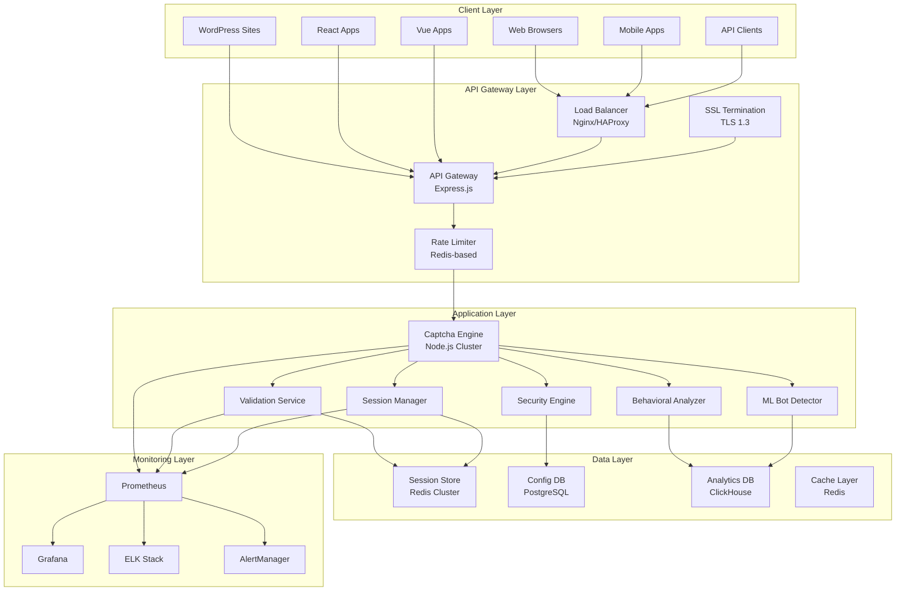
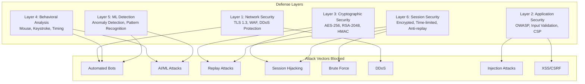

# Secure CAPTCHA Plugin

> **Enterprise-grade, non-crackable CAPTCHA solution with lightning-fast performance**

[](https://opensource.org/licenses/MIT)
[](https://www.typescriptlang.org/)
[](https://nodejs.org/)
[](#security)

## 🎯 Overview

The Secure CAPTCHA Plugin is an **enterprise-grade, open-source CAPTCHA solution** designed to provide robust protection against automated bots while maintaining exceptional user experience. Built from scratch with **security as the prime factor**, this plugin aims to be **non-crackable** while delivering **lightning-fast performance**.

### Key Objectives

1. **Non-Crackable Security**: Multi-layer defense against all known attack vectors
2. **Lightning Fast Performance**: < 100ms generation, < 50ms validation
3. **Universal Integration**: Support for 10+ frameworks and platforms
4. **Enterprise Ready**: SOC 2, GDPR compliant with comprehensive audit trails
5. **Open Source**: 10x cheaper than commercial solutions

---

## 🏗️ Architecture

### System Architecture



### Security Architecture (Non-Crackable Design)



---

## 🛡️ Security Features

### 6-Layer Defense System

| Layer | Security Feature | Protection Against |
|-------|------------------|-------------------|
| **Layer 1** | Network Security | DDoS, WAF, TLS 1.3 |
| **Layer 2** | Application Security | OWASP Top 10, Input Validation, CSP |
| **Layer 3** | Cryptographic Security | AES-256, RSA-2048, HMAC-SHA256 |
| **Layer 4** | Behavioral Analysis | Mouse, Keystroke, Timing Patterns |
| **Layer 5** | ML Detection | Anomaly Detection, Pattern Recognition |
| **Layer 6** | Session Security | Encrypted, Time-limited, Anti-replay |

### Anti-Automation Techniques

- **Dynamic Challenge Generation**: Each captcha is unique
- **Time-based Expiration**: Challenges expire in 30-60 seconds
- **Behavioral Analysis**: Mouse movement, keystroke patterns
- **Device Fingerprinting**: Browser, canvas, WebGL fingerprints
- **IP Reputation**: Known bot IP blocking
- **Rate Limiting**: Progressive delays for suspicious activity

### Anti-AI/ML Techniques

- **Adversarial Examples**: Captchas designed to fool ML models
- **Style Transfer**: Random visual styles
- **Noise Injection**: Cryptographic noise in images
- **Pattern Randomization**: Unpredictable patterns
- **Human-Only Patterns**: Patterns only humans can recognize

---

## 🚀 Technology Stack

### Core Technology Stack

| Component | Technology | Version | Purpose |
|-----------|------------|---------|---------|
| **Runtime** | Node.js | 20+ | Non-blocking I/O, high concurrency |
| **Language** | TypeScript | 5.0+ | Type safety, better DX |
| **Framework** | Express.js | 4.x | RESTful API with clustering |
| **Database** | PostgreSQL | 15+ | ACID compliance, config storage |
| **Cache** | Redis | 7+ | Sub-millisecond latency, sessions |
| **Queue** | Bull/BullMQ | Latest | Async processing, job scheduling |
| **ML** | TensorFlow.js | Latest | Real-time bot detection |

### Frontend & Integration

| Component | Technology | Purpose |
|-----------|------------|---------|
| **React** | 18+ | Component library |
| **Vue.js** | 3+ | Composition API plugin |
| **Angular** | 16+ | Standalone components |
| **Svelte** | 4+ | Runes-based components |
| **Vanilla JS** | ES2020+ | Zero-dependency SDK |

### Infrastructure

| Component | Technology | Purpose |
|-----------|------------|---------|
| **Containerization** | Docker | Multi-stage builds |
| **Orchestration** | Kubernetes | Helm charts, auto-scaling |
| **Monitoring** | Prometheus + Grafana | Metrics and dashboards |
| **Logging** | ELK Stack | Centralized logging |
| **CI/CD** | GitHub Actions | Automated testing & deployment |

---

## 🔧 Design Patterns

### 1. Factory Pattern
```typescript
// CaptchaGeneratorFactory for creating different captcha types
class CaptchaGeneratorFactory {
  static getGenerator(type: CaptchaType): CaptchaGenerator {
    switch (type) {
      case 'text': return new TextCaptchaGenerator();
      case 'math': return new MathCaptchaGenerator();
      case 'logic': return new LogicCaptchaGenerator();
      case 'image': return new ImageCaptchaGenerator();
      // ... more types
    }
  }
}
```

### 2. Strategy Pattern
```typescript
// Different validation strategies for different captcha types
interface ValidationStrategy {
  validate(session: CaptchaSession, response: string): ValidationResult;
}

class TextValidationStrategy implements ValidationStrategy { /* ... */ }
class MathValidationStrategy implements ValidationStrategy { /* ... */ }
class BehavioralValidationStrategy implements ValidationStrategy { /* ... */ }
```

### 3. Observer Pattern
```typescript
// Security event system for monitoring and alerting
class SecurityEventEmitter {
  subscribe(event: SecurityEventType, handler: EventHandler): void;
  emit(event: SecurityEvent): void;
}
```

### 4. Decorator Pattern
```typescript
// Middleware for adding security features to routes
function captchaMiddleware(options: CaptchaOptions) {
  return (req, res, next) => {
    // Add rate limiting
    // Add behavioral analysis
    // Add device fingerprinting
    next();
  };
}
```

### 5. Singleton Pattern
```typescript
// Single instance of CryptoService for key management
class CryptoService {
  private static instance: CryptoService;
  
  static getInstance(): CryptoService {
    if (!CryptoService.instance) {
      CryptoService.instance = new CryptoService();
    }
    return CryptoService.instance;
  }
}
```

### 6. Circuit Breaker Pattern
```typescript
// Resilience pattern for external service calls
class CircuitBreaker {
  private state: 'closed' | 'open' | 'half-open' = 'closed';
  private failureCount = 0;
  
  async call<T>(fn: () => Promise<T>): Promise<T> {
    if (this.state === 'open') {
      throw new Error('Circuit breaker is open');
    }
    // ... implementation
  }
}
```

---

## 🔐 Algorithms

### Cryptographic Algorithms

| Algorithm | Purpose | Key Size | Notes |
|-----------|---------|----------|-------|
| **AES-256-GCM** | Data encryption | 256-bit | Authenticated encryption |
| **RSA-2048** | Key exchange | 2048-bit | Asymmetric encryption |
| **HMAC-SHA256** | Data integrity | 256-bit | Message authentication |
| **ECDH** | Perfect forward secrecy | 256-bit | Key agreement protocol |
| **PBKDF2** | Key derivation | 256-bit | Password-based key derivation |
| **Argon2** | Password hashing | 256-bit | Memory-hard function |

### Machine Learning Algorithms

| Algorithm | Purpose | Implementation |
|-----------|---------|----------------|
| **Random Forest** | Bot detection | TensorFlow.js |
| **Neural Network** | Behavioral analysis | TensorFlow.js |
| **Anomaly Detection** | Pattern recognition | Statistical methods |
| **Clustering** | User segmentation | K-means algorithm |

### Behavioral Analysis Algorithms

| Algorithm | Purpose | Metrics |
|-----------|---------|---------|
| **Mouse Movement Analysis** | Human vs bot detection | Speed, acceleration, patterns |
| **Keystroke Dynamics** | Typing pattern analysis | Timing, pressure, rhythm |
| **Timing Analysis** | Interaction patterns | Response time, consistency |
| **Device Fingerprinting** | Unique device identification | Browser, canvas, WebGL |

---

## 📊 Performance

### Response Time Targets

| Operation | Target | Percentile |
|-----------|--------|------------|
| Captcha Generation | < 100ms | 95th |
| Captcha Validation | < 50ms | 95th |
| API Response | < 200ms | 95th |
| Page Load Impact | < 500ms | Additional load time |

### Throughput Targets

| Metric | Target |
|--------|--------|
| Concurrent Users | 100,000+ |
| Requests per Second | 10,000+ |
| Captcha Generation | 5,000+ per second |
| Validation | 20,000+ per second |

### Scalability Features

- **Horizontal Scaling**: Redis clustering, load balancing
- **Auto-scaling**: Based on CPU/memory metrics
- **Geographic Distribution**: CDN support, multi-region
- **Connection Pooling**: PostgreSQL: 100+ connections
- **Multi-level Caching**: L1: Memory, L2: Redis

---

## 🔌 Integration

### Framework Support

| Framework | Plugin Type | Integration Time |
|-----------|-------------|------------------|
| **Express.js** | Middleware | < 5 minutes |
| **Fastify** | Plugin | < 5 minutes |
| **Koa.js** | Middleware | < 5 minutes |
| **NestJS** | Module | < 5 minutes |
| **React** | Component Library | < 5 minutes |
| **Vue.js** | Plugin | < 5 minutes |
| **Angular** | Component | < 5 minutes |
| **Svelte** | Component | < 5 minutes |
| **WordPress** | Plugin | < 5 minutes |
| **Drupal** | Module | < 5 minutes |

### API Support

| API Type | Protocol | Documentation |
|----------|----------|---------------|
| **RESTful** | HTTP/HTTPS | OpenAPI 3.0 |
| **GraphQL** | HTTP/HTTPS | Schema-first |
| **WebSocket** | WS/WSS | Real-time events |
| **Webhooks** | HTTP/HTTPS | Event-driven |

### Quick Integration Examples

#### Express.js
```typescript
import { captchaMiddleware } from 'secure-captcha-plugin';

app.use('/api/protected', captchaMiddleware({
  type: 'multi-layer',
  difficulty: 'hard',
  sessionTimeout: 300000
}));
```

#### React
```tsx
import { CaptchaWidget } from 'secure-captcha-plugin/react';

<CaptchaWidget
  type="multi-layer"
  difficulty="hard"
  onVerify={(token) => handleVerify(token)}
  theme="dark"
/>
```

#### WordPress
```php
// Add to any form
<?php echo captcha_get_html(); ?>
```

---

## 📈 Monitoring & Observability

### Metrics (Prometheus)

- Request rate (requests/second)
- Request latency (histogram)
- Error rate (counter)
- Captcha generation time
- Captcha validation time
- Active sessions (gauge)
- Cache hit/miss ratio
- Security events (counter)

### Dashboards (Grafana)

- **Performance Dashboard**: Request rate, latency, throughput
- **Security Dashboard**: Security events, bot detection rate
- **Business Dashboard**: Captcha types usage, difficulty distribution

### Logging (ELK Stack)

- Structured logging with Winston
- Request/response logging
- Error logging
- Security event logging
- Performance logging
- Audit logging

---

## 🚀 Quick Start

### Installation

```bash
# Install via npm
npm install secure-captcha-plugin

# Or via yarn
yarn add secure-captcha-plugin
```

### Basic Usage

```typescript
import { CaptchaService } from 'secure-captcha-plugin';

// Initialize the service
const captchaService = new CaptchaService({
  redis: { host: 'localhost', port: 6379 },
  security: { encryptionKey: process.env.ENCRYPTION_KEY }
});

// Generate a captcha
const captcha = await captchaService.generateCaptcha('text', 'medium');

// Validate user response
const result = await captchaService.validateResponse(
  captcha.sessionId,
  userResponse
);
```

### ELK Stack Setup

The Secure CAPTCHA Plugin includes a complete ELK Stack (Elasticsearch, Logstash, Kibana) for centralized logging and monitoring.

#### Start ELK Stack

```bash
# Navigate to the elk directory
cd elk

# Start the ELK Stack using Docker Compose
docker-compose -f docker-compose.elk.yml up -d

# Check the status of all services
docker-compose -f docker-compose.elk.yml ps

# View logs
docker-compose -f docker-compose.elk.yml logs -f
```

#### Access Kibana Dashboards

Once the ELK Stack is running, access the dashboards at:

- **Kibana Dashboard**: http://localhost:5601
- **Elasticsearch**: http://localhost:9200
- **Logstash**: http://localhost:9600

#### Import Kibana Dashboards

1. Open Kibana at http://localhost:5601
2. Navigate to **Management** → **Stack Management** → **Saved Objects**
3. Click **Import** and select the dashboard files:
   - `elk/kibana/dashboards/secure-captcha-overview.json`
   - `elk/kibana/dashboards/secure-captcha-security.json`
4. Navigate to **Analytics** → **Dashboard** to view the imported dashboards

#### ELK Stack Configuration

**Environment Variables:**

```bash
# Elasticsearch Configuration
ELASTICSEARCH_NODE=http://localhost:9200
ELASTICSEARCH_USERNAME=elastic
ELASTICSEARCH_PASSWORD=changeme
ELASTICSEARCH_SSL_VERIFY=false

# Logging Configuration
LOG_LEVEL=info
LOG_CONSOLE=true
LOG_FILE=true
LOG_ELASTICSEARCH=true
LOG_FILE_PATH=./logs/app.log
LOG_MAX_FILE_SIZE=10485760
LOG_MAX_FILES=5
```

**Enable ELK Logging in Your Application:**

```typescript
import { getELKLogger } from 'secure-captcha-plugin';

// Initialize ELK Logger
const logger = getELKLogger({
  elasticsearch: {
    node: process.env.ELASTICSEARCH_NODE || 'http://localhost:9200',
    index: 'secure-captcha-logs',
    indexPrefix: 'secure-captcha',
    indexSuffixPattern: 'YYYY.MM.DD'
  },
  logLevel: 'info',
  enableConsole: true,
  enableFile: true,
  enableElasticsearch: true
});

// Use the logger
logger.logRequest({ endpoint: '/api/captcha', method: 'POST' });
logger.logSecurityEvent({ action: 'captcha_generated', resource: 'text' });
logger.logPerformance('captcha_generation_time', 45);
```

#### Kibana Dashboard Features

**Overview Dashboard:**
- Log volume over time by log type
- Log level distribution (debug, info, warn, error)
- Average response time trends
- Captcha type usage statistics
- Error rate monitoring
- Top accessed endpoints
- Geographic distribution of requests

**Security Dashboard:**
- Security events timeline
- Security event types distribution
- Failed validations over time
- Rate limit violations
- Suspicious activity detection
- Top attacking IP addresses
- Security events geographic map

#### Stopping ELK Stack

```bash
# Stop all services
docker-compose -f docker-compose.elk.yml down

# Stop and remove volumes (clears all data)
docker-compose -f docker-compose.elk.yml down -v

# Remove all images
docker-compose -f docker-compose.elk.yml down --rmi all
```

#### Troubleshooting ELK Stack

**Check Service Health:**

```bash
# Elasticsearch health
curl http://localhost:9200/_cluster/health?pretty

# Kibana status
curl http://localhost:5601/api/status

# Logstash stats
curl http://localhost:9600/_node/stats?pretty
```

**View Service Logs:**

```bash
# Elasticsearch logs
docker logs secure-captcha-elasticsearch

# Logstash logs
docker logs secure-captcha-logstash

# Kibana logs
docker logs secure-captcha-kibana
```

**Common Issues:**

1. **Elasticsearch won't start**: Increase Docker memory to at least 4GB
2. **Kibana can't connect**: Wait for Elasticsearch to be healthy first
3. **No logs appearing**: Check that `LOG_ELASTICSEARCH=true` is set
4. **Permission errors**: Run Docker with `--user root` or fix volume permissions

### Application Testing

Test the running application with these commands:

```bash
# Start the application
npm run start

# Test health check endpoint
curl http://localhost:3000/api/v1/health

# Test captcha generation
curl -X POST http://localhost:3000/api/v1/captcha/generate \
  -H "Content-Type: application/json" \
  -d '{"type":"text","difficulty":"easy"}'

# Test captcha validation
curl -X POST http://localhost:3000/api/v1/captcha/validate \
  -H "Content-Type: application/json" \
  -d '{"sessionId":"your-session-id","response":"user-response"}'

# Test captcha types endpoint
curl http://localhost:3000/api/v1/captcha/types

# Test metrics endpoint
curl http://localhost:3000/api/v1/metrics

# Test with different captcha types
curl -X POST http://localhost:3000/api/v1/captcha/generate \
  -H "Content-Type: application/json" \
  -d '{"type":"math","difficulty":"medium"}'

curl -X POST http://localhost:3000/api/v1/captcha/generate \
  -H "Content-Type: application/json" \
  -d '{"type":"logic","difficulty":"hard"}'

curl -X POST http://localhost:3000/api/v1/captcha/generate \
  -H "Content-Type: application/json" \
  -d '{"type":"image","difficulty":"easy"}'
```

### Performance Testing

```bash
# Test API response times
time curl -s http://localhost:3000/api/v1/health

# Test concurrent requests (requires Apache Bench)
ab -n 1000 -c 100 http://localhost:3000/api/v1/health

# Test captcha generation performance
ab -n 500 -c 50 -p post_data.json -T application/json \
  http://localhost:3000/api/v1/captcha/generate
```

**Sample post_data.json:**
```json
{
  "type": "text",
  "difficulty": "medium"
}
```

### Docker Deployment

```bash
# Pull the image
docker pull secure-captcha-plugin:latest

# Run the container
docker run -d \
  -p 3000:3000 \
  -e REDIS_HOST=redis \
  -e POSTGRES_HOST=postgres \
  secure-captcha-plugin:latest
```

### Kubernetes Deployment

The Secure CAPTCHA Plugin includes production-ready Kubernetes manifests and Helm charts for easy deployment.

#### Option 1: Helm Chart (Recommended)

```bash
# Add dependencies (Redis and PostgreSQL)
cd helm/secure-captcha
helm dependency update

# Install the chart
helm install secure-captcha ./helm/secure-captcha \
  --namespace secure-captcha \
  --create-namespace \
  --set app.image.repository=secure-captcha \
  --set app.image.tag=latest

# Or install with custom values
helm install secure-captcha ./helm/secure-captcha \
  --namespace secure-captcha \
  --create-namespace \
  -f custom-values.yaml

# Upgrade an existing release
helm upgrade secure-captcha ./helm/secure-captcha \
  --namespace secure-captcha

# Uninstall
helm uninstall secure-captcha --namespace secure-captcha
```

**Helm Chart Features:**
- Automatic Redis and PostgreSQL deployment (via Bitnami charts)
- Horizontal Pod Autoscaling (3-10 replicas)
- Pod Disruption Budgets for high availability
- Network Policies for pod-to-pod security
- RBAC with least-privilege access
- ServiceMonitor for Prometheus integration
- Ingress with TLS and security headers

**Customizing the Deployment:**

Create a `custom-values.yaml` file:

```yaml
app:
  replicaCount: 5
  image:
    repository: your-registry/secure-captcha
    tag: v1.0.0
  resources:
    requests:
      cpu: 200m
      memory: 512Mi
    limits:
      cpu: 1000m
      memory: 1Gi

config:
  REDIS_HOST: redis-cluster
  POSTGRES_HOST: postgres-cluster
  LOG_LEVEL: debug

ingress:
  hosts:
    - host: captcha.yourdomain.com
      paths:
        - path: /
          pathType: Prefix
  tls:
    - secretName: captcha-tls
      hosts:
        - captcha.yourdomain.com
```

#### Option 2: Raw Kubernetes Manifests

```bash
# Create namespace
kubectl apply -f k8s/namespace.yaml

# Create secrets (update with your actual values)
kubectl apply -f k8s/secret.yaml

# Create configmap
kubectl apply -f k8s/configmap.yaml

# Create persistent volume claims
kubectl apply -f k8s/pvc.yaml

# Create RBAC resources
kubectl apply -f k8s/rbac.yaml

# Create network policies
kubectl apply -f k8s/network-policy.yaml

# Create deployments and services
kubectl apply -f k8s/deployment.yaml
kubectl apply -f k8s/service.yaml

# Create ingress
kubectl apply -f k8s/ingress.yaml

# Create horizontal pod autoscaler
kubectl apply -f k8s/hpa.yaml

# Or apply all at once
kubectl apply -f k8s/
```

#### Verifying the Deployment

```bash
# Check pod status
kubectl get pods -n secure-captcha

# Check services
kubectl get svc -n secure-captcha

# Check ingress
kubectl get ingress -n secure-captcha

# Check HPA status
kubectl get hpa -n secure-captcha

# View logs
kubectl logs -f deployment/secure-captcha -n secure-captcha

# Port forward for local testing
kubectl port-forward svc/secure-captcha-service 3000:80 -n secure-captcha

# Test the deployment
curl http://localhost:3000/api/v1/health
```

#### Kubernetes Architecture

The deployment includes:

- **Main Application**: 3-10 replicas with auto-scaling
- **Redis**: Session management and caching
- **PostgreSQL**: Persistent data storage
- **Prometheus**: Metrics collection
- **Grafana**: Metrics visualization
- **Network Policies**: Pod-to-pod communication security
- **RBAC**: Least-privilege access control
- **Pod Disruption Budgets**: High availability guarantees
- **Horizontal Pod Autoscaling**: Automatic scaling based on CPU/memory

#### Production Considerations

1. **Update Secrets**: Replace base64-encoded secrets in `k8s/secret.yaml` with your actual values
2. **Configure Ingress**: Update `k8s/ingress.yaml` with your domain and TLS certificates
3. **Storage Classes**: Adjust `storageClassName` in `k8s/pvc.yaml` for your cloud provider
4. **Resource Limits**: Tune resource requests/limits based on your workload
5. **Monitoring**: Access Grafana at `grafana.captcha.example.com` for dashboards

---

## 📚 Documentation

- **[Functional Specification](tasks/FUNCTIONAL_SPECIFICATION.md)**: Complete functional requirements
- **[Implementation Plan](tasks/IMPLEMENTATION_PLAN.md)**: 24-week implementation timeline
- **[Detailed TODO](tasks/DETAILED_TODO.md)**: Granular task breakdown
- **[Testing Strategy](tasks/TESTING_STRATEGY.md)**: Comprehensive testing approach

---

## 🤝 Contributing

We welcome contributions! Please see our [Contributing Guide](CONTRIBUTING.md) for details.

### Development Setup

```bash
# Clone the repository
git clone https://github.com/your-org/secure-captcha-plugin.git

# Install dependencies
npm install

# Run tests
npm test

# Start development server
npm run dev
```

---

## 📄 License

This project is licensed under the MIT License - see the [LICENSE](LICENSE) file for details.

---

## 🙏 Acknowledgments

- Built with TypeScript for type safety
- Uses Jest for comprehensive testing
- Implements enterprise-grade security practices

---

## 📞 Support

- **Documentation**: [docs.secure-captcha-plugin.com](https://docs.secure-captcha-plugin.com)
- **Issues**: [GitHub Issues](https://github.com/your-org/secure-captcha-plugin/issues)
- **Discussions**: [GitHub Discussions](https://github.com/your-org/secure-captcha-plugin/discussions)
- **Security**: [Security Policy](SECURITY.md)

---

**Made with ❤️ for secure web applications**