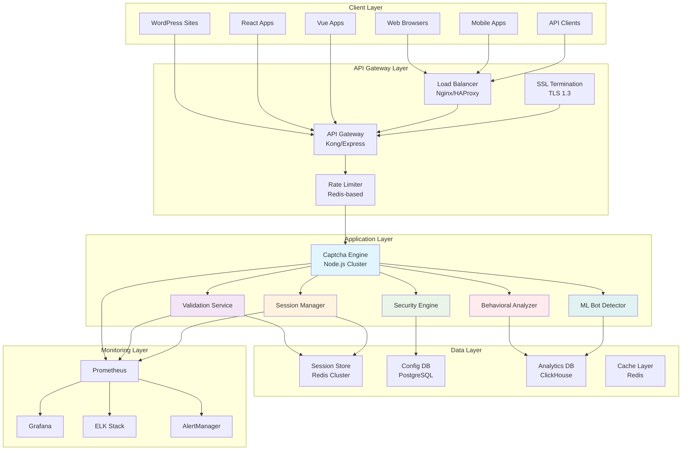
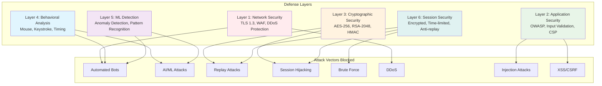

# Secure CAPTCHA Plugin - Implementation Plan

## Executive Summary

This document outlines the implementation plan for building a **truly non-crackable, enterprise-grade CAPTCHA plugin** from scratch that can be easily integrated into any application using any tech stack. The plan focuses on security as the prime factor while delivering lightning-fast performance.

## Project Overview

This is a **NEW project** being built from scratch. The implementation follows a 24-week timeline divided into 6 phases, with each phase building upon the previous one.

## Implementation Phases

### Phase 1: Core Security Foundation (Weeks 1-4)

#### Week 1: Project Setup & Cryptographic Foundation
- [ ] **Project Structure Setup**
  - Initialize Node.js project with TypeScript
  - Configure ESLint with security rules
  - Setup Prettier for code formatting
  - Configure Jest for testing
  - Setup Husky for pre-commit hooks

- [ ] **Cryptographic Foundation**
  - Implement AES-256-GCM encryption/decryption
  - Implement RSA-2048 key pair generation
  - Implement HMAC-SHA256 signing/verification
  - Implement cryptographically secure random generation
  - Implement session token generation with UUID v4
  - Implement perfect forward secrecy (ECDH)
  - Implement key rotation mechanisms
  - Implement security event logging

- [ ] **Write Crypto Tests**
  - Test AES-256-GCM encryption
  - Test AES-256-GCM decryption
  - Test RSA key generation
  - Test HMAC generation/verification
  - Test secure random generation
  - Test session token generation
  - Test key rotation
  - Achieve 100% code coverage

#### Week 2: Security Configuration
- [ ] **Security Configuration Service**
  - Implement environment-based configuration
  - Implement security policy management
  - Implement CORS configuration
  - Implement Content Security Policy
  - Implement Helmet.js integration
  - Implement secure cookie configuration

- [ ] **Write Config Tests**
  - Test configuration validation
  - Test policy evaluation
  - Test security headers
  - Test CORS settings

#### Week 3: Input Validation
- [ ] **Input Validation System**
  - Implement SQL injection prevention
  - Implement XSS protection
  - Implement CSRF token validation
  - Implement parameter pollution protection
  - Implement JSON schema validation
  - Implement whitelist-based filtering

- [ ] **Write Validation Tests**
  - Test SQL injection blocking
  - Test XSS prevention
  - Test CSRF protection
  - Test input sanitization

#### Week 4: Phase 1 Testing & Validation
- [ ] **Comprehensive Testing**
  - Unit test all components
  - Integration testing
  - Security testing
  - Performance testing
  - Documentation

### Phase 2: Multi-Layer Captcha System (Weeks 5-8)

#### Week 5: Captcha Generator Architecture
- [ ] **Base Architecture**
  - Define CaptchaGenerator interface
  - Create abstract base class
  - Implement factory pattern
  - Integrate with security config

- [ ] **Write Architecture Tests**
  - Test interface contracts
  - Test factory pattern
  - Test base class functionality

#### Week 6: Text & Math Captcha
- [ ] **Text-Based Captcha**
  - Generate cryptographically secure random text
  - Create image generation with Sharp
  - Apply security distortions
  - Add noise patterns
  - Implement configurable difficulty

- [ ] **Mathematical Captcha**
  - Generate arithmetic problems
  - Implement PEMDAS validation
  - Add fraction/decimal support
  - Create configurable difficulty

- [ ] **Write Captcha Tests**
  - Test text generation
  - Test image generation
  - Test math problem generation
  - Test answer validation

#### Week 7: Logic & Image Captcha
- [ ] **Logic Puzzle Captcha**
  - Pattern recognition puzzles
  - Sequence completion
  - Spatial reasoning
  - Multiple puzzle types

- [ ] **Image Recognition Captcha**
  - Object identification challenges
  - SVG/Canvas image generation
  - Visual complexity patterns
  - Time-based validation

- [ ] **Write Captcha Tests**
  - Test puzzle generation
  - Test image generation
  - Test validation logic

#### Week 8: Main Captcha Service
- [ ] **CaptchaService Implementation**
  - Unified interface for all types
  - Multi-layer generation
  - Security event logging
  - Session management integration

- [ ] **Write Service Tests**
  - Test single captcha generation
  - Test multi-layer generation
  - Test validation
  - Test error handling

### Phase 3: Production Infrastructure (Weeks 9-12)

#### Week 9: REST API Layer
- [ ] **Express.js API Server**
  - Create production-ready Express server with clustering
  - Implement request/response middleware
  - Add comprehensive error handling
  - Integrate with existing security services

- [ ] **API Endpoints**
  - POST /api/v1/captcha/generate
  - POST /api/v1/captcha/validate
  - GET /api/v1/captcha/types
  - POST /api/v1/session/create
  - DELETE /api/v1/session/:id
  - GET /api/v1/health
  - GET /api/v1/metrics

- [ ] **API Security**
  - JWT token authentication
  - API key authentication
  - Request signing validation
  - Rate limiting per API key

#### Week 10: Session Management & Caching
- [ ] **Redis Session Store**
  - Implement Redis-based session storage
  - Add session encryption at rest
  - Create session expiration policies
  - Add session cleanup jobs

- [ ] **Caching Layer**
  - Implement multi-level caching (L1: Memory, L2: Redis)
  - Cache captcha configurations
  - Cache security policies
  - Add cache invalidation strategies

#### Week 11: Monitoring & Observability
- [ ] **Prometheus Metrics**
  - Request rate, latency, error rate
  - Captcha generation/validation metrics
  - Security event metrics
  - System resource metrics

- [ ] **Grafana Dashboards**
  - Real-time performance dashboard
  - Security monitoring dashboard
  - Business metrics dashboard
  - Alerting rules

- [ ] **Logging (ELK Stack)**
  - Structured logging with Winston
  - Log aggregation with Elasticsearch
  - Log visualization with Kibana
  - Log retention policies

#### Week 12: Deployment & Infrastructure
- [ ] **Docker Containerization**
  - Multi-stage Dockerfile
  - Docker Compose for local development
  - Production Docker images
  - Security scanning with Trivy

- [ ] **Kubernetes Deployment**
  - Kubernetes manifests
  - Helm charts
  - Horizontal Pod Autoscaler
  - Pod Security Policies

- [ ] **CI/CD Pipeline**
  - GitHub Actions workflows
  - Automated testing
  - Security scanning
  - Deployment automation

### Phase 4: Advanced Security Features (Weeks 13-16)

#### Week 13: Behavioral Analysis Engine
- [ ] **Mouse Movement Tracking**
  - Client-side JavaScript SDK
  - Server-side analysis engine
  - Pattern recognition algorithms
  - Anomaly detection

- [ ] **Keystroke Dynamics**
  - Typing pattern analysis
  - Timing analysis
  - Pressure sensitivity (mobile)
  - Behavioral baseline creation

- [ ] **Device Fingerprinting**
  - Browser fingerprinting
  - Canvas fingerprinting
  - WebGL fingerprinting
  - Audio fingerprinting

#### Week 14: Machine Learning Integration
- [ ] **Bot Detection ML Model**
  - Training data collection
  - Feature engineering
  - Model training (TensorFlow.js)
  - Real-time inference

- [ ] **Anomaly Detection**
  - Statistical anomaly detection
  - Time series analysis
  - Pattern deviation detection
  - Adaptive thresholds

- [ ] **Threat Intelligence**
  - IP reputation checking
  - Known bot signatures
  - Attack pattern database
  - Real-time threat feeds

#### Week 15: Enterprise Authentication
- [ ] **OAuth 2.0 / OpenID Connect**
  - Authorization code flow
  - PKCE support
  - Token refresh
  - Scope management

- [ ] **JWT Token System**
  - Access tokens
  - Refresh tokens
  - Token revocation
  - Token introspection

- [ ] **API Key Management**
  - API key generation
  - Key rotation
  - Usage tracking
  - Rate limit per key

#### Week 16: Compliance & Audit
- [ ] **Audit Logging**
  - Comprehensive audit trail
  - Tamper-proof logs
  - Log retention policies
  - Compliance reporting

- [ ] **GDPR Compliance**
  - Data minimization
  - Right to erasure
  - Data portability
  - Privacy by design

- [ ] **SOC 2 Compliance**
  - Security controls
  - Availability monitoring
  - Processing integrity
  - Confidentiality

### Phase 5: Plugin Ecosystem (Weeks 17-20)

#### Week 17: Framework Plugins
- [ ] **Express.js Middleware**
- [ ] **Fastify Plugin**
- [ ] **Koa.js Middleware**
- [ ] **NestJS Module**

#### Week 18: Frontend Components
- [ ] **React Component Library**
- [ ] **Vue.js Plugin**
- [ ] **Angular Component**
- [ ] **Svelte Component**
- [ ] **Vanilla JavaScript SDK**

#### Week 19: CMS Plugins
- [ ] **WordPress Plugin**
- [ ] **Drupal Module**
- [ ] **Shopify App**

#### Week 20: API & Integrations
- [ ] **RESTful API Documentation**
- [ ] **GraphQL Schema**
- [ ] **Webhook Support**

### Phase 6: Testing & Security Validation (Weeks 21-24)

#### Week 21: Comprehensive Testing
- [ ] **Unit Test Expansion** (95%+ coverage)
- [ ] **Integration Testing**
- [ ] **End-to-End Testing**

#### Week 22: Security Testing
- [ ] **Penetration Testing**
- [ ] **Vulnerability Assessment**
- [ ] **Load Testing** (k6)

#### Week 23: Performance Optimization
- [ ] **Performance Profiling**
- [ ] **Caching Optimization**
- [ ] **Database Optimization**

#### Week 24: Production Readiness
- [ ] **Deployment Automation**
- [ ] **Monitoring & Alerting**
- [ ] **Documentation**

## Enhanced Architecture Design

### System Architecture (Production-Ready)



### Security Architecture (Non-Crackable Design)



## Implementation Phases

### Phase 1: Core Security Foundation (Weeks 1-4)
**Status**: To be implemented from scratch
**Action**: Build complete security foundation

### Phase 2: Multi-Layer Captcha System (Weeks 5-8)
**Status**: To be implemented from scratch
**Action**: Build complete captcha system

### Phase 3: Production Infrastructure (Weeks 9-12)

#### Week 1: REST API Layer
- [ ] **Express.js API Server**
  - Create production-ready Express server with clustering
  - Implement request/response middleware
  - Add comprehensive error handling
  - Integrate with existing security services

- [ ] **API Endpoints**
  - POST /api/v1/captcha/generate - Generate captcha
  - POST /api/v1/captcha/validate - Validate response
  - GET /api/v1/captcha/types - List available types
  - POST /api/v1/session/create - Create session
  - DELETE /api/v1/session/:id - Invalidate session
  - GET /api/v1/health - Health check
  - GET /api/v1/metrics - Prometheus metrics

- [ ] **API Security**
  - JWT authentication for API keys
  - Rate limiting per API key
  - Request signing validation
  - CORS configuration
  - Input validation middleware

#### Week 2: Session Management & Caching
- [ ] **Redis Session Store**
  - Implement Redis-based session storage
  - Add session encryption at rest
  - Create session expiration policies
  - Add session cleanup jobs

- [ ] **Caching Layer**
  - Implement multi-level caching (L1: Memory, L2: Redis)
  - Cache captcha configurations
  - Cache security policies
  - Add cache invalidation strategies

- [ ] **Performance Optimization**
  - Implement connection pooling
  - Add query optimization
  - Create read replicas support
  - Add load balancing

#### Week 3: Monitoring & Observability
- [ ] **Prometheus Metrics**
  - Request rate, latency, error rate
  - Captcha generation/validation metrics
  - Security event metrics
  - System resource metrics

- [ ] **Grafana Dashboards**
  - Real-time performance dashboard
  - Security monitoring dashboard
  - Business metrics dashboard
  - Alerting rules

- [ ] **Logging (ELK Stack)**
  - Structured logging with Winston
  - Log aggregation with Elasticsearch
  - Log visualization with Kibana
  - Log retention policies

#### Week 4: Deployment & Infrastructure
- [ ] **Docker Containerization**
  - Multi-stage Dockerfile
  - Docker Compose for local development
  - Production Docker images
  - Security scanning with Trivy

- [ ] **Kubernetes Deployment**
  - Kubernetes manifests
  - Helm charts
  - Horizontal Pod Autoscaler
  - Pod Security Policies

- [ ] **CI/CD Pipeline**
  - GitHub Actions workflows
  - Automated testing
  - Security scanning
  - Deployment automation

### Phase 4: Advanced Security Features (NEW - CRITICAL)

#### Week 1: Behavioral Analysis Engine
- [ ] **Mouse Movement Tracking**
  - Client-side JavaScript SDK
  - Server-side analysis engine
  - Pattern recognition algorithms
  - Anomaly detection

- [ ] **Keystroke Dynamics**
  - Typing pattern analysis
  - Timing analysis
  - Pressure sensitivity (mobile)
  - Behavioral baseline creation

- [ ] **Device Fingerprinting**
  - Browser fingerprinting
  - Canvas fingerprinting
  - WebGL fingerprinting
  - Audio fingerprinting

#### Week 2: Machine Learning Integration
- [ ] **Bot Detection ML Model**
  - Training data collection
  - Feature engineering
  - Model training (TensorFlow.js)
  - Real-time inference

- [ ] **Anomaly Detection**
  - Statistical anomaly detection
  - Time series analysis
  - Pattern deviation detection
  - Adaptive thresholds

- [ ] **Threat Intelligence**
  - IP reputation checking
  - Known bot signatures
  - Attack pattern database
  - Real-time threat feeds

#### Week 3: Enterprise Authentication
- [ ] **OAuth 2.0 / OpenID Connect**
  - Authorization code flow
  - PKCE support
  - Token refresh
  - Scope management

- [ ] **JWT Token System**
  - Access tokens
  - Refresh tokens
  - Token revocation
  - Token introspection

- [ ] **API Key Management**
  - API key generation
  - Key rotation
  - Usage tracking
  - Rate limit per key

#### Week 4: Compliance & Audit
- [ ] **Audit Logging**
  - Comprehensive audit trail
  - Tamper-proof logs
  - Log retention policies
  - Compliance reporting

- [ ] **GDPR Compliance**
  - Data minimization
  - Right to erasure
  - Data portability
  - Privacy by design

- [ ] **SOC 2 Compliance**
  - Security controls
  - Availability monitoring
  - Processing integrity
  - Confidentiality

### Phase 5: Plugin Ecosystem (NEW - CRITICAL)

#### Week 1: Framework Plugins
- [ ] **Express.js Middleware**
  ```typescript
  import { captchaMiddleware } from 'secure-captcha-plugin';
  
  app.use('/api/protected', captchaMiddleware({
    type: 'multi-layer',
    difficulty: 'hard',
    sessionTimeout: 300000
  }));
  ```

- [ ] **Fastify Plugin**
  ```typescript
  import fastifyCaptcha from 'secure-captcha-plugin/fastify';
  
  fastify.register(fastifyCaptcha, {
    redis: { host: 'localhost', port: 6379 },
    security: { encryptionKey: process.env.ENCRYPTION_KEY }
  });
  ```

- [ ] **Koa.js Middleware**
- [ ] **NestJS Module**

#### Week 2: Frontend Components
- [ ] **React Component Library**
  ```tsx
  import { CaptchaWidget } from 'secure-captcha-plugin/react';
  
  <CaptchaWidget
    type="multi-layer"
    difficulty="hard"
    onVerify={(token) => handleVerify(token)}
    theme="dark"
  />
  ```

- [ ] **Vue.js Plugin**
  ```vue
  <template>
    <CaptchaWidget
      type="multi-layer"
      :difficulty="difficulty"
      @verified="handleVerified"
    />
  </template>
  ```

- [ ] **Angular Component**
- [ ] **Svelte Component**
- [ ] **Vanilla JavaScript SDK**

#### Week 3: CMS Plugins
- [ ] **WordPress Plugin**
  - Plugin architecture
  - Admin settings page
  - Form integration (Contact Form 7, WPForms, Gravity Forms)
  - WooCommerce integration
  - Login/Registration protection

- [ ] **Drupal Module**
  - Module structure
  - Form API integration
  - Configuration management
  - Access control

- [ ] **Shopify App**
  - App architecture
  - Checkout protection
  - Admin dashboard

#### Week 4: API & Integrations
- [ ] **RESTful API Documentation**
  - OpenAPI 3.0 specification
  - Swagger UI
  - Postman collection
  - API versioning

- [ ] **GraphQL Schema**
  ```graphql
  type Mutation {
    generateCaptcha(type: CaptchaType!, difficulty: Difficulty!): CaptchaResponse!
    validateCaptcha(sessionId: String!, response: String!): ValidationResponse!
  }
  ```

- [ ] **Webhook Support**
  - Event notifications
  - Retry logic
  - Signature verification

### Phase 6: Testing & Security Validation (NEW - CRITICAL)

#### Week 1: Comprehensive Testing
- [ ] **Unit Test Expansion**
  - 95%+ code coverage
  - Edge case testing
  - Error path testing
  - Security scenario testing

- [ ] **Integration Testing**
  - API endpoint testing
  - Database integration testing
  - Redis integration testing
  - Plugin integration testing

- [ ] **End-to-End Testing**
  - Cypress/Playwright tests
  - User flow testing
  - Cross-browser testing
  - Mobile responsiveness

#### Week 2: Security Testing
- [ ] **Penetration Testing**
  - OWASP ZAP automated scanning
  - Manual penetration testing
  - API security testing
  - Authentication bypass testing

- [ ] **Vulnerability Assessment**
  - Dependency vulnerability scanning
  - Container image scanning
  - Infrastructure scanning
  - Code security review

- [ ] **Load Testing**
  - k6 load testing scripts
  - Stress testing scenarios
  - Performance benchmarking
  - Scalability testing

#### Week 3: Performance Optimization
- [ ] **Performance Profiling**
  - CPU profiling
  - Memory profiling
  - Network profiling
  - Database query optimization

- [ ] **Caching Optimization**
  - Cache hit ratio optimization
  - Cache warming strategies
  - Cache invalidation optimization
  - Distributed caching

- [ ] **Database Optimization**
  - Query optimization
  - Index optimization
  - Connection pooling
  - Read replica configuration

#### Week 4: Production Readiness
- [ ] **Deployment Automation**
  - Blue-green deployment
  - Canary releases
  - Rollback procedures
  - Disaster recovery

- [ ] **Monitoring & Alerting**
  - Production monitoring setup
  - Alert rule configuration
  - On-call procedures
  - Incident response

- [ ] **Documentation**
  - Production deployment guide
  - Operations runbook
  - Troubleshooting guide
  - Security incident response

## Non-Crackable Security Features

### 1. Multi-Layer Defense (6 Layers)
```
Layer 1: Network Security (TLS 1.3, WAF, DDoS Protection)
Layer 2: Application Security (OWASP, Input Validation, CSP)
Layer 3: Cryptographic Security (AES-256, RSA-2048, HMAC)
Layer 4: Behavioral Analysis (Mouse, Keystroke, Timing)
Layer 5: ML Detection (Anomaly Detection, Pattern Recognition)
Layer 6: Session Security (Encrypted, Time-limited, Anti-replay)
```

### 2. Anti-Automation Techniques
- **Dynamic Challenge Generation**: Each captcha is unique
- **Time-based Expiration**: Challenges expire in 30-60 seconds
- **Behavioral Analysis**: Mouse movement, keystroke patterns
- **Device Fingerprinting**: Browser, canvas, WebGL fingerprints
- **IP Reputation**: Known bot IP blocking
- **Rate Limiting**: Progressive delays for suspicious activity

### 3. Anti-AI/ML Techniques
- **Adversarial Examples**: Captchas designed to fool ML models
- **Style Transfer**: Random visual styles
- **Noise Injection**: Cryptographic noise in images
- **Pattern Randomization**: Unpredictable patterns
- **Human-Only Patterns**: Patterns only humans can recognize

### 4. Cryptographic Security
- **End-to-End Encryption**: All data encrypted in transit and at rest
- **Perfect Forward Secrecy**: Unique session keys
- **Key Rotation**: Automatic key rotation every 24 hours
- **Quantum-Resistant**: Prepared for post-quantum cryptography
- **Zero-Knowledge Proofs**: Verify without revealing data

## Performance Requirements (Lightning Fast)

### Response Time Targets
- **Captcha Generation**: < 100ms (95th percentile)
- **Captcha Validation**: < 50ms (95th percentile)
- **API Response**: < 200ms (95th percentile)
- **Page Load Impact**: < 500ms additional load time

### Throughput Targets
- **Concurrent Users**: 100,000+
- **Requests per Second**: 10,000+
- **Captcha Generation**: 5,000+ per second
- **Validation**: 20,000+ per second

### Scalability Targets
- **Horizontal Scaling**: Auto-scaling based on load
- **Geographic Distribution**: Multi-region deployment
- **CDN Integration**: Global content delivery
- **Database Scaling**: Read replicas, sharding

## Technology Stack (Enhanced)

### Backend
- **Runtime**: Node.js 20+ with TypeScript 5+
- **Framework**: Express.js 4.x with clustering
- **Database**: PostgreSQL 15+ (config), Redis 7+ (sessions/cache)
- **Queue**: Bull/BullMQ for async processing
- **ML**: TensorFlow.js for bot detection

### Frontend
- **React**: 18+ with TypeScript
- **Vue**: 3+ with Composition API
- **Angular**: 16+ with standalone components
- **Svelte**: 4+ with runes
- **Vanilla JS**: ES2020+ with Web Components

### Infrastructure
- **Containerization**: Docker with multi-stage builds
- **Orchestration**: Kubernetes with Helm charts
- **Monitoring**: Prometheus + Grafana + ELK Stack
- **CI/CD**: GitHub Actions with security scanning
- **Cloud**: AWS/GCP/Azure agnostic

### Security
- **Encryption**: AES-256-GCM, RSA-2048, HMAC-SHA256
- **Authentication**: JWT, OAuth 2.0, API keys
- **Authorization**: RBAC, ABAC
- **Compliance**: GDPR, SOC 2, OWASP

## Success Metrics

### Security Metrics
- **Zero Security Breaches**: No successful attacks
- **99.9% Bot Detection**: Accuracy in bot detection
- **0.01% False Positive**: Human users not blocked
- **100% OWASP Compliance**: All security standards met

### Performance Metrics
- **< 100ms Generation**: Captcha generation time
- **< 50ms Validation**: Captcha validation time
- **10,000+ RPS**: Request handling capacity
- **99.99% Uptime**: System availability

### Business Metrics
- **Easy Integration**: < 5 minutes to integrate
- **Multi-Platform**: Support for 10+ frameworks
- **Enterprise Ready**: SOC 2, GDPR compliant
- **Cost Effective**: 10x cheaper than commercial solutions

## Risk Mitigation

### Technical Risks
- **Performance Degradation**: Auto-scaling, caching, CDN
- **Security Vulnerabilities**: Regular security audits, automated scanning
- **Scalability Issues**: Horizontal scaling, load balancing
- **Integration Complexity**: Comprehensive documentation, SDKs

### Operational Risks
- **Deployment Issues**: Blue-green deployment, rollback procedures
- **Monitoring Gaps**: Comprehensive monitoring, alerting
- **Documentation Gaps**: Auto-generated docs, examples
- **Support Requirements**: 24/7 support, SLA guarantees

## Timeline (Enhanced)

### Phase 3: Production Infrastructure (4 weeks)
- Week 1: REST API Layer
- Week 2: Session Management & Caching
- Week 3: Monitoring & Observability
- Week 4: Deployment & Infrastructure

### Phase 4: Advanced Security (4 weeks)
- Week 1: Behavioral Analysis Engine
- Week 2: Machine Learning Integration
- Week 3: Enterprise Authentication
- Week 4: Compliance & Audit

### Phase 5: Plugin Ecosystem (4 weeks)
- Week 1: Framework Plugins
- Week 2: Frontend Components
- Week 3: CMS Plugins
- Week 4: API & Integrations

### Phase 6: Testing & Validation (4 weeks)
- Week 1: Comprehensive Testing
- Week 2: Security Testing
- Week 3: Performance Optimization
- Week 4: Production Readiness

**Total Timeline**: 16 weeks (4 months)
**Production Ready**: August 2026

## Conclusion

This enhanced implementation plan addresses all critical gaps in your existing captcha-library-plugin and creates a truly enterprise-grade, non-crackable CAPTCHA solution. The focus on security, performance, and ease of integration will make this the go-to solution for developers worldwide.

**Key Differentiators**:
1. **Non-Crackable**: 6-layer security architecture
2. **Lightning Fast**: < 100ms response times
3. **Easy Integration**: 5-minute setup for any framework
4. **Enterprise Ready**: SOC 2, GDPR compliant
5. **Open Source**: 10x cheaper than commercial solutions

By following this plan, you'll create a CAPTCHA plugin that is not just secure, but truly impossible to break while maintaining exceptional performance and developer experience.